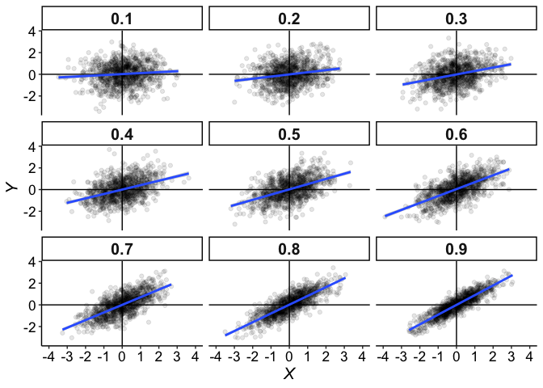
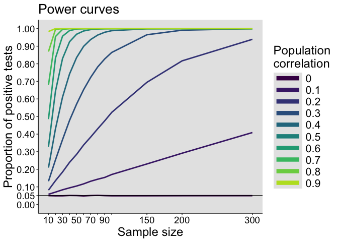
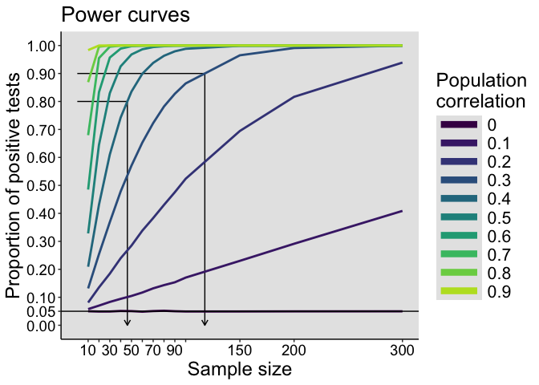
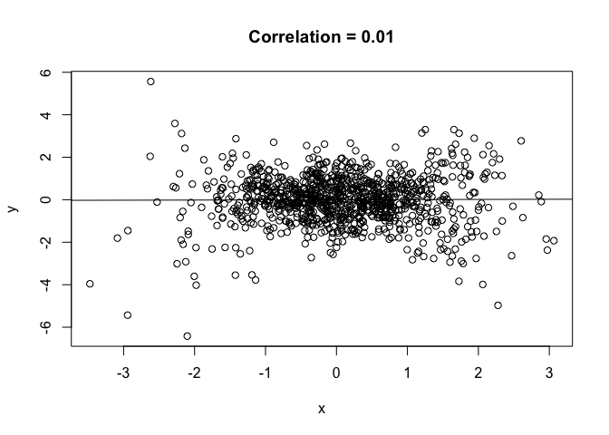
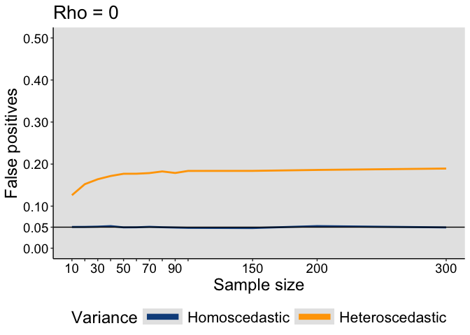
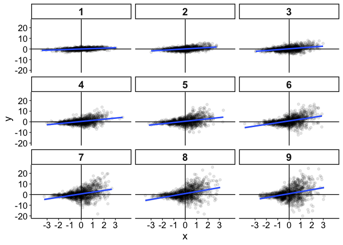
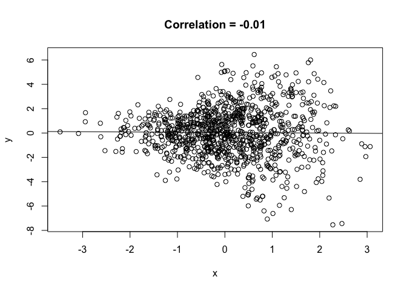
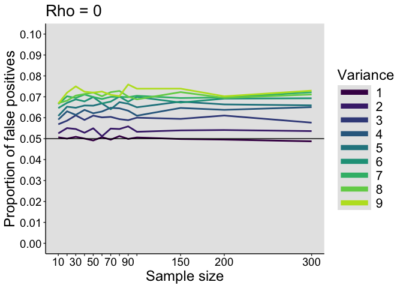
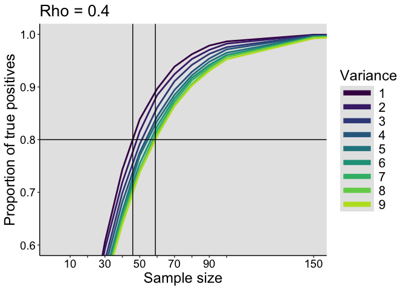

Correlation estimation: power
================
Guillaume A. Rousselet
2025-09-09

- [Dependencies](#dependencies)
- [Resources for power analyses](#resources-for-power-analyses)
- [Examples of homoscedastic
  distributions](#examples-of-homoscedastic-distributions)
- [Power as a function of sample size and rho: homoscedastic
  case](#power-as-a-function-of-sample-size-and-rho-homoscedastic-case)
  - [Parameters](#parameters)
  - [Simulation](#simulation)
  - [Plot results](#plot-results)
  - [Plot results with arrows](#plot-results-with-arrows)
  - [Summary figure: precision &
    power](#summary-figure-precision--power)
- [Problems with Pearson’s
  correlation](#problems-with-pearsons-correlation)
  - [Wilcox’s heteroscedasticity
    example](#wilcoxs-heteroscedasticity-example)
  - [Plot results](#plot-results-1)
- [Examples of heteroscedastic
  distributions](#examples-of-heteroscedastic-distributions)
- [Power as a function of sample size: heteroscedastic
  case](#power-as-a-function-of-sample-size-heteroscedastic-case)
  - [Example with rho = 0 & max var =
    3](#example-with-rho--0--max-var--3)
  - [Test heteroscedastic data
    generation](#test-heteroscedastic-data-generation)
  - [Simulation with rho = 0](#simulation-with-rho--0)
  - [Simulation with rho = 0.4](#simulation-with-rho--04)
- [References](#references)

# Dependencies

``` r
library(ggplot2)
library(tibble)
library(dplyr)
library(cowplot)
library(Cairo)
```

``` r
sessionInfo()
```

    ## R version 4.2.2 (2022-10-31)
    ## Platform: x86_64-apple-darwin17.0 (64-bit)
    ## Running under: macOS Big Sur ... 10.16
    ## 
    ## Matrix products: default
    ## BLAS:   /Library/Frameworks/R.framework/Versions/4.2/Resources/lib/libRblas.0.dylib
    ## LAPACK: /Library/Frameworks/R.framework/Versions/4.2/Resources/lib/libRlapack.dylib
    ## 
    ## locale:
    ## [1] en_US.UTF-8/en_US.UTF-8/en_US.UTF-8/C/en_US.UTF-8/en_US.UTF-8
    ## 
    ## attached base packages:
    ## [1] stats     graphics  grDevices utils     datasets  methods   base     
    ## 
    ## other attached packages:
    ## [1] Cairo_1.6-2   cowplot_1.1.1 dplyr_1.1.4   tibble_3.2.1  ggplot2_3.5.1
    ## 
    ## loaded via a namespace (and not attached):
    ##  [1] rstudioapi_0.14   knitr_1.50        magrittr_2.0.3    tidyselect_1.2.1 
    ##  [5] munsell_0.5.1     colorspace_2.1-1  R6_2.6.1          rlang_1.1.5      
    ##  [9] fastmap_1.2.0     tools_4.2.2       grid_4.2.2        gtable_0.3.6     
    ## [13] xfun_0.51         cli_3.6.4         withr_3.0.2       htmltools_0.5.8.1
    ## [17] yaml_2.3.10       digest_0.6.37     lifecycle_1.0.4   vctrs_0.6.5      
    ## [21] glue_1.8.0        evaluate_1.0.3    rmarkdown_2.29    compiler_4.2.2   
    ## [25] pillar_1.10.1     generics_0.1.3    scales_1.3.0      pkgconfig_2.0.3

# Resources for power analyses

Sommet N, Weissman DL, Cheutin N, Elliot AJ. How Many Participants Do I
Need to Test an Interaction? Conducting an Appropriate Power Analysis
and Achieving Sufficient Power to Detect an Interaction. Advances in
Methods and Practices in Psychological Science. 2023;6(3).
<doi:10.1177/25152459231178728>

<https://www.statmethods.net/stats/power.html>

<https://cran.r-project.org/web/packages/pwr/vignettes/pwr-vignette.html>

<http://www.sample-size.net/correlation-sample-size/>

A non-technical guide to performing power analysis in R
<https://www.youtube.com/watch?v=ZIjOG8LTTh8>

How Many Participants Do We Have to Include in Properly Powered
Experiments? A Tutorial of Power Analysis with Reference Tables
<https://pubmed.ncbi.nlm.nih.gov/31517234/>

Understanding Mixed-Effects Models Through Data Simulation
<https://journals.sagepub.com/doi/full/10.1177/2515245920965119>

Kumle, L., Võ, M. L.-H., & Draschkow, D. (2021). Estimating power in
(generalized) linear mixed models: An open introduction and tutorial in
R. Behavior Research Methods, 53(6), 2528–2543.
<https://doi.org/10.3758/s13428-021-01546-0>

Power Analysis with Superpower
<https://aaroncaldwell.us/SuperpowerBook/>

A Practical Guide to Statistical Power and Sample Size Calculations in R
<https://cran.r-project.org/web/packages/pwrss/vignettes/examples.html>

Simulation-Based Power Analysis for Factorial Analysis of Variance
Designs <https://journals.sagepub.com/doi/full/10.1177/2515245920951503>

But remember that all standard power calculators assume parametric tests
and ideal conditions. That means that in practice, your power is lower
than you think
<https://garstats.wordpress.com/2017/11/28/your-power-is-lower-than-you-think/>

# Examples of homoscedastic distributions

We look at examples of n=1000 bivariate distributions from populations
with known correlations, with rho increasing from 0.1 to 0.9 in steps of
0.1. For each rho, we draw a random sample and plot *Y* as a function of
*X*. The variances of the two correlated variables are independent -
there is homoscedasticity. Later we will look at an heteroscedasticity
case: the variance of *Y* will vary as a function of *X*.

``` r
set.seed(21)
n <- 1000
rho.seq <- seq(0.1, 0.9, 0.1)
Nrho <- length(rho.seq)
sd.x <- rep(1, n)
sd.y <- rep(1, n) # homoscedastic sd
mu.x <- rep(0, n)
mu.y <- rep(0, n)

res.x <- matrix(data = 0, nrow = n, ncol = Nrho) 
res.y <- matrix(data = 0, nrow = n, ncol = Nrho) 

# Generate data
  for(iter.rho in 1:Nrho){
      rho <- rho.seq[iter.rho]
      x <- sort(rnorm(n, mu.x, sd.x))
      y <- rnorm(n, mu.y + (sd.y/sd.x) * rho * (x - mu.x), sqrt((1 - rho^2)*sd.y^2))
      res.x[, iter.rho] <- x
      res.y[, iter.rho] <- y
  }

# make data frame
df <- tibble(`x` = as.vector(res.x),
             `y` = as.vector(res.y),
             `rho` = rep(rho.seq, each = n))

df$rho <- as.character(df$rho)
df$rho <- factor(df$rho, levels=unique(df$rho))

# ggplot figure
ggplot(df, aes(x = x, y = y)) + theme_classic() +
  geom_hline(yintercept = 0) +
  geom_vline(xintercept = 0) +
  geom_point(alpha = 0.1) +
  geom_smooth(method='lm',formula=y~x) +
  theme(axis.title = element_text(size = 15, colour = "black"),
        axis.text = element_text(size = 13, colour = "black"),
        strip.text = element_text(size = 15, face = "bold")) +
  scale_x_continuous(limits = c(-4, 4),
                     breaks = seq(-4, 4, 1)) +
  labs(x = expression(italic("X")), y = expression(italic("Y"))) +
  facet_wrap(~rho)
```

<!-- -->

``` r
# save figure
# ggsave(filename = './figures/demo_homo_dist.pdf', width = 9, height = 7)
```

# Power as a function of sample size and rho: homoscedastic case

For the same distributions illustrated in the previous figure, we
compute the proportion of positive Pearson’s correlation tests for
different sample sizes. This gives us power curves. We also include rho
= 0 to determine the proportion of false positives.

## Parameters

``` r
nseq <- c(seq(10, 100, 10), 150, 200, 300) # sample sizes
Nn <- length(nseq)
p <- 2
mu <- 0
mu <- rep(mu, p)
nsim <- 50000
rho.seq <- seq(0, 0.9, 0.1) # rho=0 for false positives
Nrho <- length(rho.seq)
```

## Simulation

``` r
set.seed(21)

res.power <- matrix(data = 0, nrow = Nrho, ncol = Nn) # count p<=0.05

for(iter.n in 1:Nn){
  
  print(paste0("Sample size = ", nseq[iter.n]))
  n <- nseq[iter.n]
  
  sd.x <- rep(1, n)
  sd.y <- rep(1, n)
  mu.x <- rep(0, n)
  mu.y <- rep(0, n)
  
  for(iter.rho in 1:Nrho){
    
    rho <- rho.seq[iter.rho]
    # sigma <- diag(p)
    # sigma[sigma==0] <- rho.seq[iter.rho]
    
    for(iter in 1:nsim){
      
      # using mvrnorm =======================================
      # data <- MASS::mvrnorm(n = n, mu = mu, Sigma = sigma)
      # out <- cor.test(data[,1],data[,2], method = "pearson")
      
      # using Y conditional on X ======================
      # https://www.r-bloggers.com/simulating-from-the-bivariate-normal-distribution-in-r/
      x <- rnorm(n, mu.x, sd.x)
      y <- rnorm(n, mu.y + (sd.y/sd.x) * rho * (x - mu.x), sqrt((1 - rho^2)*sd.y^2))
      out <- cor.test(x,y, method = "pearson")
      if(out$p.value <= 0.05){
      res.power[iter.rho,iter.n] <- res.power[iter.rho,iter.n] + 1
      }
    }
  }
}
res.power <- res.power / nsim
save(res.power,
     file = "./data/corr_power.RData")
```

To generate data that are correlated but not normal, things get much
more complicated. See Rousselet et al. (2023) for an example, in which I
adapted code from Ruscio & Kaczetow (2008).

## Plot results

Power increases with sample size and with rho. When $\rho = 0$, the
proportion of positive tests is the proportion of false positives. These
should be around 0.05 for a test with alpha = 0.05. This is the case
here, as Pearson’s correlation is well behaved for bivariate normal
data.

``` r
# get data
load("./data/corr_power.RData")
xlabels <- c("10","","30","","50","","70","","90","","150","200","300") 

# make data frame
df <- tibble(`Power`=as.vector(res.power),
             `Size`=rep(nseq,each=Nrho),
             `Rho`=rep(rho.seq,Nn))

df$Rho <- as.character(df$Rho)
df$Rho <- factor(df$Rho, levels=unique(df$Rho))

# make plot
p <- ggplot(df, aes(Size, Power)) + theme_classic() +
          geom_line(aes(colour = Rho), linewidth = 1)  + 
          geom_hline(yintercept = 0.05) +
          scale_color_viridis_d(end = 0.9) + 
          theme(axis.title.x = element_text(size = 18),
                axis.text = element_text(size = 14, colour = "black"),
                axis.title.y = element_text(size = 18),
                legend.key.width = unit(1.5,"cm"),
                legend.text = element_text(size = 16),
                legend.title = element_text(size = 18),
                legend.position = "right",
                plot.title = element_text(size = 20, colour = "black"),
                panel.background = element_rect(fill="grey90")) +
   scale_x_continuous(breaks = nseq, labels = xlabels) +
          scale_y_continuous(limits = c(0, 1), 
                             breaks = c(0, 0.05, seq(0.1, 1, 0.1))) +
  labs(x = "Sample size", y = "Proportion of positive tests") +
  # ggtitle("Power in the homoscedastic case") +
  ggtitle("Power curves") +
  guides(colour = guide_legend(override.aes = list(linewidth=3), # make thicker legend lines
        title="Population\ncorrelation")) # change legend title
p
```

<!-- -->

``` r
# save figure
# ggsave(filename='./figures/figure_power_homo.pdf',width=9,height=5)
```

## Plot results with arrows

For a given true population correlation and a desired long run power
value, we can use interpolation to find out the matching sample size.

To achieve at least 80% power given a population rho of 0.4, the minimum
sample size is 46 observations.

To achieve at least 90% power given a population rho of 0.3, the minimum
sample size is 118 observations.

Alternatively, for a given sample size and a desired power, we can
determine the minimum effect size we can hope to detect (again, this is
in the long run, there is no guarantee for a single experiment). For
instance, given n = 40 and a desired power of at least 90%, the minimum
effect size we can detect is 0.49.

``` r
# get data
load("./data/corr_power.RData")
xlabels <- c("10","","30","","50","","70","","90","","150","200","300") 

# make data frame
df <- tibble(`Power`=as.vector(res.power),
             `Size`=rep(nseq,each=Nrho),
             `Rho`=rep(rho.seq,Nn))

df$Rho <- as.character(df$Rho)
df$Rho <- factor(df$Rho, levels=unique(df$Rho))

# minimum n for power = 0.8 and rho = 0.4
tmp.pos <- approx(y=nseq,x=res.power[5,],xout=0.8)$y
df.seg1 <- tibble(x=0, xend=tmp.pos,
                  y=0.8, yend=0.8)
df.seg2 <- tibble(x=tmp.pos, xend=tmp.pos,
                  y=0.8, yend=0)

# minimum n for power = 0.9 and rho = 0.3
tmp.pos <- approx(y=nseq,x=res.power[4,],xout=0.9)$y
df.seg3 <- tibble(x=0, xend=tmp.pos,
                  y=0.9, yend=0.9)
df.seg4 <- tibble(x=tmp.pos, xend=tmp.pos,
                  y=0.9, yend=0)

# make plot
p <- ggplot(df, aes(Size, Power)) + theme_classic() +
          geom_segment(data = df.seg1, aes(x=x, y=y, xend=xend, yend=yend)) +
          geom_segment(data = df.seg2, aes(x=x, y=y, xend=xend, yend=yend), 
                       arrow = arrow(length = unit(0.2, "cm"))) +
          geom_segment(data = df.seg3, aes(x=x, y=y, xend=xend, yend=yend)) +
          geom_segment(data = df.seg4, aes(x=x, y=y, xend=xend, yend=yend), 
               arrow = arrow(length = unit(0.2, "cm"))) +
          geom_line(aes(colour = Rho), linewidth = 1)  + 
          geom_hline(yintercept = 0.05) +
          scale_color_viridis_d(end = 0.9) + 
          theme(axis.title.x = element_text(size = 18),
                axis.text = element_text(size = 14, colour = "black"),
                axis.title.y = element_text(size = 18),
                legend.key.width = unit(1.5,"cm"),
                legend.text = element_text(size = 16),
                legend.title = element_text(size = 18),
                legend.position = "right",
                plot.title = element_text(size = 20, colour = "black"),
                panel.background = element_rect(fill="grey90")) +
   scale_x_continuous(breaks = nseq, labels = xlabels) +
          scale_y_continuous(limits = c(0, 1), 
                             breaks = c(0, 0.05, seq(0.1, 1, 0.1))) +
  labs(x = "Sample size", y = "Proportion of positive tests") +
  # ggtitle("Power in the homoscedastic case") +
  ggtitle("Power curves") +
  guides(colour = guide_legend(override.aes = list(linewidth=3), # make thicker legend lines
        title="Population\ncorrelation")) # change legend title
p
```

<!-- -->

``` r
p.power.homo <- p

# save figure
# ggsave(filename='./figures/figure_power_homo_arrows.pdf',width=9,height=5)
```

## Summary figure: precision & power

``` r
# require(cowplot)
# combine panels into one figure
cowplot::plot_grid(p.precision,  p.power.homo,
                          labels = c("A", "B"),
                          ncol = 2,
                          nrow = 1,
                          rel_widths = c(1, 1), 
                          label_size = 20, 
                          hjust = -0.5, 
                          scale=.95,
                          align = "h")
# save figure
# ggsave(filename='./figures/fig_precision.tiff', width=15, height=6, dpi=300)
ggsave(filename='./figures/fig_precision.pdf', width=15, height=6, device = cairo_pdf)
```

# Problems with Pearson’s correlation

Wilcox (2012 p. 444-445) describes 6 aspects of data that affect
Pearson’s r:

- outliers
- the magnitude of the slope around which points are clustered
- curvature
- the magnitude of the residuals
- restriction of range
- heteroscedasticity

The effect of outliers on Pearson’s and Spearman’s correlations is
described in detail in Pernet et al. (2012) and Rousselet et al. (2012).

## Wilcox’s heteroscedasticity example

If we correlate variable *X* with variable *Y*, heteroscedasticity means
that the variance of *Y* depends on *X*. Wilcox considers this example:
“*X* and *Y* have normal distributions with both means equal to zero.
\[…\] *X* and *Y* have variance 1 unless \|*X*\|\>0.5, in which case *Y*
has standard deviation \|*X*\|.”

Here is an example of such data:

``` r
set.seed(21)
n <- 1000
rho <- 0
sd.x <- rep(1, n)
h <- 3
mu.x <- rep(0, n)
mu.y <- rep(0, n)

# using conditional distribution ======================
# https://www.r-bloggers.com/simulating-from-the-bivariate-normal-distribution-in-r/
x <- rnorm(n, mu.x, sd.x)
sd.y <- rep(1, n)
sd.y[abs(x)>0.5] <- abs(x[abs(x)>0.5]) 
y <- rnorm(n, mu.y + (sd.y/sd.x) * rho * (x - mu.x), sqrt((1 - rho^2)*sd.y^2))

plot(x,y, main = paste0("Correlation = ",round(cor(x,y), digits = 2)))
abline(lsfit(x,y)) 
```

<!-- -->

### ggplot version

``` r
# make data frame
df <- tibble(`x` = x,
             `y` = y)

# ggplot figure
ggplot(df, aes(x = x, y = y)) + theme_classic() +
  geom_hline(yintercept = 0) +
  geom_vline(xintercept = 0) +
  geom_point(alpha = 0.3) +
  geom_smooth(method='lm',formula=y~x) +
  theme(axis.title = element_text(size = 15, colour = "black"),
        axis.text = element_text(size = 13, colour = "black"),
        strip.text = element_text(size = 15, face = "bold")) +
  scale_x_continuous(limits = c(-4, 4),
                     breaks = seq(-4, 4, 1)) +
  labs(x = expression(italic("X")), y = expression(italic("Y")))
```

<!-- -->

``` r
# save figure
# ggsave(filename = './figures/demo_wilcox_dist.pdf', width = 9, height = 7)
```

### False positives

#### Simulation

``` r
set.seed(44444)

nseq <- c(seq(10, 100, 10), 150, 200, 300) # sample sizes
Nn <- length(nseq)
nsim <- 50000
rho <- 0

res.power <- matrix(data = 0, nrow = 2, ncol = Nn) # count p<=0.05

for(iter.n in 1:Nn){
  
  n <- nseq[iter.n]
  print(paste0("Sample size = ", n))
  sd.x <- rep(1, n)
  mu.x <- rep(0, n)
  mu.y <- rep(0, n)
  
  for(iter in 1:nsim){
    # using Y conditional on X ======================
    # https://www.r-bloggers.com/simulating-from-the-bivariate-normal-distribution-in-r/
    x <- rnorm(n, mu.x, sd.x)
    sd.y <- rep(1, n)
    # homoscedastic results
    y <- rnorm(n, mu.y + (sd.y/sd.x) * rho * (x - mu.x), sqrt((1 - rho^2)*sd.y^2))
    out <- cor.test(x, y, method = "pearson")
    if(out$p.value <= 0.05){
      res.power[1,iter.n] <- res.power[1,iter.n] + 1
    }
    # heteroscedastic results
    sd.y[abs(x)>0.5] <- abs(x[abs(x)>0.5]) 
    y <- rnorm(n, mu.y + (sd.y/sd.x) * rho * (x - mu.x), sqrt((1 - rho^2)*sd.y^2))
    out <- cor.test(x, y, method = "pearson")
    if(out$p.value <= 0.05){
      res.power[2,iter.n] <- res.power[2,iter.n] + 1
    }
  }
}
res.power <- res.power / nsim
save(res.power,
     file = "./data/corr_power_hetero_wilcox.RData")
```

## Plot results

In the homoscedastic case, as expected for a test with alpha = 0.05, the
proportion of false positives is very close to 0.05 at every sample
size. In the heteroscedastic case, instead of 5%, the number of false
positives is between 12% and 19%. The number of false positives actually
increases with sample size! That’s because the standard *T* statistics
associated with Pearson’s correlation assumes homoscedasticity, so the
formula is incorrect when there is heteroscedasticity.

``` r
# get data
load("./data/corr_power_hetero_wilcox.RData")
xlabels <- c("10","","30","","50","","70","","90","","150","200","300") 

# make data frame
df <- tibble(`Power`=as.vector(res.power),
             `Size`=rep(nseq,each=2),
             `Var`=rep(c("Homoscedastic", "Heteroscedastic"),Nn))

df$Var <- as.character(df$Var)
df$Var <- factor(df$Var, levels=unique(df$Var))

# make plot
p <- ggplot(df, aes(Size, Power)) + theme_classic() +
          geom_line(aes(colour = Var), linewidth = 1)  + 
          geom_hline(yintercept = 0.05) +
          scale_colour_manual(values = c("dodgerblue4", "orange1")) + 
          theme(axis.title.x = element_text(size = 18),
                axis.text = element_text(size = 14, colour = "black"),
                axis.title.y = element_text(size = 18),
                legend.key.width = unit(1.5,"cm"),
                legend.text = element_text(size = 16),
                legend.title = element_text(size = 18),
                legend.position = "bottom",
                plot.title = element_text(size = 20, colour = "black"),
                panel.background = element_rect(fill="grey90")) +
   scale_x_continuous(breaks = nseq, labels = xlabels) +
          scale_y_continuous(limits = c(0, 0.5), 
                             breaks = c(0, 0.05, seq(0.1, 1, 0.1))) +
  labs(x = "Sample size", y = "False positives") +
  ggtitle("Rho = 0") +
  guides(colour = guide_legend(override.aes = list(linewidth=3), # make thicker legend lines
        title="Variance")) # change legend title
p
```

<!-- -->

``` r
# save figure
# ggsave(filename='./figures/figure_power_hetero_wilcox.pdf',width=9,height=5) 
```

# Examples of heteroscedastic distributions

Let’s consider another heteroscedastic situation, in which the variance
of *Y* increases linearly with *X*. This could correspond for instance
to situations in which cognitive performance or income are correlated
with age - we might expect the variance amongst participants to increase
with age.

We keep rho constant at 0.4 and increase the maximum variance from 1
(homoscedastic case) to 9. That is, the variance of *Y* linear increases
from 1 to the maximum variance as a function of *X*.

``` r
set.seed(21)
n <- 1000
var.seq <- seq(1, 9, 1)
Nvar <- length(var.seq)
sd.x <- rep(1, n)
mu.x <- rep(0, n)
mu.y <- rep(0, n)
rho <- 0.4
res.x <- matrix(data = 0, nrow = n, ncol = Nvar) 
res.y <- matrix(data = 0, nrow = n, ncol = Nvar) 

# Generate data
for(iter.var in 1:Nvar){
  
  x <- sort(rnorm(n, mu.x, sd.x))
  sd.y <- seq(1, var.seq[iter.var], length.out = n) # conditional sd
  y <- rnorm(n, mu.y + (sd.y/sd.x) * rho * (x - mu.x), sqrt((1 - rho^2)*sd.y^2))
  
  res.x[, iter.var] <- x
  res.y[, iter.var] <- y
}

# make data frame
df <- tibble(`x` = as.vector(res.x),
             `y` = as.vector(res.y),
             `var` = rep(var.seq, each = n))

df$var <- as.character(df$var)
df$var <- factor(df$var, levels=unique(df$var))

# ggplot figure
ggplot(df, aes(x = x, y = y)) + theme_classic() +
  geom_hline(yintercept = 0) +
  geom_vline(xintercept = 0) +
  geom_point(alpha = 0.1) +
  geom_smooth(method='lm',formula=y~x) +
  theme(axis.title = element_text(size = 15, colour = "black"),
        axis.text = element_text(size = 13, colour = "black"),
        strip.text = element_text(size = 15, face = "bold")) +
  scale_x_continuous(limits = c(-4, 4),
                     breaks = seq(-3, 3, 1)) +
  facet_wrap(~var)
```

<!-- -->

``` r
# save figure
# ggsave(filename = './figures/demo_hetero_dist.pdf', width = 9, height = 7)
```

``` r
# Correlation for each var level
summarize(group_by(df, var), cor(x,y))
```

    ## # A tibble: 9 × 2
    ##   var   `cor(x, y)`
    ##   <fct>       <dbl>
    ## 1 1           0.397
    ## 2 2           0.407
    ## 3 3           0.405
    ## 4 4           0.400
    ## 5 5           0.368
    ## 6 6           0.435
    ## 7 7           0.365
    ## 8 8           0.384
    ## 9 9           0.335

# Power as a function of sample size: heteroscedastic case

## Example with rho = 0 & max var = 3

``` r
set.seed(21)
n <- 1000
rho <- 0
sd.x <- rep(1, n)
h <- 3
sd.y <- seq(1, h, length.out = n) # sequence of sd from 1 to h, conditional on x
mu.x <- rep(0, n)
mu.y <- rep(0, n)

# using conditional distribution ======================
# https://www.r-bloggers.com/simulating-from-the-bivariate-normal-distribution-in-r/
x <- sort(rnorm(n, mu.x, sd.x))
y <- rnorm(n, mu.y + (sd.y/sd.x) * rho * (x - mu.x), sqrt((1 - rho^2)*sd.y^2))

plot(x,y, main = paste0("Correlation = ",round(cor(x,y), digits = 2)))
abline(lsfit(x,y)) 
```

<!-- -->

## Test heteroscedastic data generation

Estimation is slightly biased (mean and median) for max sd.y = 2, and
the sampling distributions seem to be negatively skewed. This should
lead to lower power than in the homoscedastic case. For max sd.y = 5 the
skewness seeems to increase and the bias increases.

``` r
set.seed(7)

res.cor <- vector(mode = "numeric", length = nsim) 
rho <- 0.3
n <- 50
h <- 2
sd.x <- rep(1, n)
sd.y <- seq(1, h, length.out = n) # sequence of sd from 1 to h, conditional on x
mu.x <- rep(0, n)
mu.y <- rep(0, n)
  
for(iter in 1:nsim){
  # using conditional distribution ======================
  # https://www.r-bloggers.com/simulating-from-the-bivariate-normal-distribution-in-r/
  x <- sort(rnorm(n, mu.x, sd.x))
  y <- rnorm(n, mu.y + (sd.y/sd.x) * rho * (x - mu.x), sqrt((1 - rho^2)*sd.y^2))
  res.cor[iter] <- cor(x, y, method = "pearson")
}
hist(res.cor, main = paste0("Median corr = ", round(median(res.cor),digits = 3),"; mean corr = ", round(mean(res.cor),digits = 3))) 
```

``` r
set.seed(7)

res.cor <- vector(mode = "numeric", length = nsim) 
rho <- 0.3
n <- 50
h <- 5
sd.x <- rep(1, n)
sd.y <- seq(1, h, length.out = n) # sequence of sd from 1 to h, conditional on x
mu.x <- rep(0, n)
mu.y <- rep(0, n)
  
for(iter in 1:nsim){
  # using conditional distribution ======================
  # https://www.r-bloggers.com/simulating-from-the-bivariate-normal-distribution-in-r/
  x <- sort(rnorm(n, mu.x, sd.x))
  y <- rnorm(n, mu.y + (sd.y/sd.x) * rho * (x - mu.x), sqrt((1 - rho^2)*sd.y^2))
  res.cor[iter] <- cor(x, y, method = "pearson")
}
hist(res.cor, main = paste0("Median corr = ", round(median(res.cor),digits = 3),"; mean corr = ", round(mean(res.cor),digits = 3))) 
```

## Simulation with rho = 0

### Parameters

``` r
nseq <- c(seq(10, 100, 10), 150, 200, 300) # sample sizes
Nn <- length(nseq)
nsim <- 50000
var.seq <- seq(1, 9, 1) # 1 = homoscedastic; >1 = heteroscedastic 
Nvar <- length(var.seq)
rho <- 0
```

### Simulation

``` r
set.seed(778899)

res.power <- matrix(data = 0, nrow = Nvar, ncol = Nn) # count p<=0.05

for(iter.n in 1:Nn){
  
  n <- nseq[iter.n]
  print(paste0("Sample size = ", n))
  sd.x <- rep(1, n)
  mu.x <- rep(0, n)
  mu.y <- rep(0, n)
  
  for(iter.var in 1:Nvar){
    
    # sequence of sd from 1 to var.seq[iter.var], conditional on x
    sd.y <- seq(1, var.seq[iter.var], length.out = n) 
    
    for(iter in 1:nsim){
      # using conditional distribution ======================
      # https://www.r-bloggers.com/simulating-from-the-bivariate-normal-distribution-in-r/
      x <- sort(rnorm(n, mu.x, sd.x))
      y <- rnorm(n, mu.y + (sd.y/sd.x) * rho * (x - mu.x), sqrt((1 - rho^2)*sd.y^2))
      out <- cor.test(x, y, method = "pearson")
      if(out$p.value <= 0.05){
      res.power[iter.var,iter.n] <- res.power[iter.var,iter.n] + 1
      }
    }
  }
}
res.power <- res.power / nsim
save(res.power,
     file = "./data/corr_power_hetero_rho0.RData")
```

### Plot results

``` r
# get data
load("./data/corr_power_hetero_rho0.RData")
xlabels <- c("10","","30","","50","","70","","90","","150","200","300") 

# make data frame
df <- tibble(`Power`=as.vector(res.power),
             `Size`=rep(nseq,each=Nvar),
             `var`=rep(var.seq,Nn))

df$var <- as.character(df$var)
df$var <- factor(df$var, levels=unique(df$var))

# make plot
p <- ggplot(df, aes(Size, Power)) + theme_classic() +
          geom_line(aes(colour = var), linewidth = 1)  + 
          geom_hline(yintercept = 0.05) +
          scale_color_viridis_d(end = 0.9) + 
          theme(axis.title.x = element_text(size = 18),
                axis.text = element_text(size = 14, colour = "black"),
                axis.title.y = element_text(size = 18),
                legend.key.width = unit(1.5,"cm"),
                legend.text = element_text(size = 16),
                legend.title = element_text(size = 18),
                legend.position = "right",
                plot.title = element_text(size = 20, colour = "black"),
                panel.background = element_rect(fill="grey90")) +
   scale_x_continuous(breaks = nseq, labels = xlabels) +
          scale_y_continuous(limits = c(0, 0.1), 
                             breaks = seq(0, 0.1, 0.01)) +
  labs(x = "Sample size", y = "Proportion of false positives") +
  ggtitle("Rho = 0") +
  guides(colour = guide_legend(override.aes = list(linewidth=3), # make thicker legend lines
        title="Variance")) # change legend title
p
```

<!-- -->

``` r
# save figure
# ggsave(filename='./figures/figure_power_hetero_rho0.pdf',width=9,height=5) 
```

## Simulation with rho = 0.4

### Parameters

``` r
nseq <- c(seq(10, 100, 10), 150, 200, 300) # sample sizes
Nn <- length(nseq)
nsim <- 50000
var.seq <- seq(1, 9, 1) # 1 = homoscedastic; >1 = heteroscedastic 
Nvar <- length(var.seq)
rho <- 0.4
```

### Simulation

``` r
set.seed(778899)

res.power <- matrix(data = 0, nrow = Nvar, ncol = Nn) # count p<=0.05

for(iter.n in 1:Nn){
  
  n <- nseq[iter.n]
  print(paste0("Sample size = ", n))
  sd.x <- rep(1, n)
  mu.x <- rep(0, n)
  mu.y <- rep(0, n)
  
  for(iter.var in 1:Nvar){
    
    # sequence of sd from 1 to var.seq[iter.var], conditional on x
    sd.y <- seq(1, var.seq[iter.var], length.out = n) 
    
    for(iter in 1:nsim){
      # using conditional distribution ======================
      # https://www.r-bloggers.com/simulating-from-the-bivariate-normal-distribution-in-r/
      x <- sort(rnorm(n, mu.x, sd.x))
      y <- rnorm(n, mu.y + (sd.y/sd.x) * rho * (x - mu.x), sqrt((1 - rho^2)*sd.y^2))
      out <- cor.test(x, y, method = "pearson")
      if(out$p.value <= 0.05){
      res.power[iter.var,iter.n] <- res.power[iter.var,iter.n] + 1
      }
    }
  }
}
res.power <- res.power / nsim
save(res.power,
     file = "./data/corr_power_hetero_rho04.RData")
```

### Plot results

Power progressively decreases with increasing heteroscedasticity. Put
another way, with larger heteroscedasticity, larger sample sizes are
needed to achieve the same power.

``` r
# get data
load("./data/corr_power_hetero_rho04.RData")
xlabels <- c("10","","30","","50","","70","","90","","150","200","300") 

# make data frame
df <- tibble(`Power`=as.vector(res.power),
             `Size`=rep(nseq,each=Nvar),
             `var`=rep(var.seq,Nn))

df$var <- as.character(df$var)
df$var <- factor(df$var, levels=unique(df$var))

# make plot
p <- ggplot(df, aes(Size, Power)) + theme_classic() +
          geom_line(aes(colour = var), linewidth = 1)  + 
          geom_hline(yintercept = 0.05) +
          scale_color_viridis_d(end = 0.9) + 
          theme(axis.title.x = element_text(size = 18),
                axis.text = element_text(size = 14, colour = "black"),
                axis.title.y = element_text(size = 18),
                legend.key.width = unit(1.5,"cm"),
                legend.text = element_text(size = 16),
                legend.title = element_text(size = 18),
                legend.position = "right",
                plot.title = element_text(size = 20, colour = "black"),
                panel.background = element_rect(fill="grey90")) +
   scale_x_continuous(breaks = nseq, labels = xlabels) +
          scale_y_continuous(limits = c(0, 1), 
                             breaks = c(0, 0.05, seq(0.1, 1, 0.1))) +
  labs(x = "Sample size", y = "Proportion of true positives") +
  ggtitle("Rho = 0.4") +
  guides(colour = guide_legend(override.aes = list(linewidth=3), # make thicker legend lines
        title="Variance")) # change legend title
p
```

<!-- -->

``` r
# save figure
# ggsave(filename='./figures/figure_power_hetero_rho04.pdf',width=9,height=5) 
```

### Plot results: zoom in

``` r
# get data
load("./data/corr_power_hetero_rho04.RData")
xlabels <- c("10","","30","","50","","70","","90","","150","200","300") 

# make data frame
df <- tibble(`Power`=as.vector(res.power),
             `Size`=rep(nseq,each=Nvar),
             `var`=rep(var.seq,Nn))

df$var <- as.character(df$var)
df$var <- factor(df$var, levels=unique(df$var))

# make plot
p <- ggplot(df, aes(Size, Power)) + theme_classic() +
          geom_line(aes(colour = var), linewidth = 1)  + 
          geom_hline(yintercept = 0.05) +
          geom_hline(yintercept = 0.8) +
          geom_vline(xintercept = c(46, 59)) +
          scale_color_viridis_d(end = 0.9) + 
          theme(axis.title.x = element_text(size = 18),
                axis.text = element_text(size = 14, colour = "black"),
                axis.title.y = element_text(size = 18),
                legend.key.width = unit(1.5,"cm"),
                legend.text = element_text(size = 16),
                legend.title = element_text(size = 18),
                legend.position = "right",
                plot.title = element_text(size = 20, colour = "black"),
                panel.background = element_rect(fill="grey90")) +
   scale_x_continuous(breaks = nseq, labels = xlabels) +
          scale_y_continuous(limits = c(0, 1), 
                             breaks = c(0, 0.05, seq(0.1, 1, 0.1))) +
  labs(x = "Sample size", y = "Proportion of true positives") +
  ggtitle("Rho = 0.4") +
  guides(colour = guide_legend(override.aes = list(linewidth=3), # make thicker legend lines
        title="Variance")) + # change legend title 
  coord_cartesian(xlim = c(0, 150), ylim = c(0.6, 1), expand = TRUE)

p
```

<!-- -->

``` r
# save figure
# ggsave(filename='./figures/figure_power_hetero_rho04_zoom.pdf',width=9,height=5) 
```

# References

Pernet, C.R., Wilcox, R. & Rousselet, G.A. (2012) Robust correlation
analyses: false positive and power validation using a new open source
matlab toolbox. Front Psychol, 3, 606.

Rousselet, G.A. & Pernet, C.R. (2012) Improving standards in
brain-behavior correlation analyses. Frontiers in human neuroscience, 6,
119.

Rousselet, G. A., Pernet, C. R., & Wilcox, R. R. (2023). An introduction
to the bootstrap: A versatile method to make inferences by using
data-driven simulations. Meta-Psychology, 7.
<https://doi.org/10.15626/MP.2019.2058>

Ruscio, J., & Kaczetow, W. (2008). Simulating Multivariate Nonnormal
Data Using an Iterative Algorithm. Multivariate Behavioral Research,
43(3), 355–381. <https://doi.org/10.1080/00273170802285693>

Wilcox, R.R. (2012) Introduction to robust estimation and hypothesis
testing. Academic Press, San Diego, CA.
