Correlation estimation
================
Guillaume A. Rousselet
2025-09-09

- [Dependencies](#dependencies)
- [Define mode function](#define-mode-function)
- [Check `cor()` function](#check-cor-function)
  - [n = 10](#n--10)
  - [n = 100](#n--100)
- [Fake correlation](#fake-correlation)
- [Correlation estimates as a function of sample
  size](#correlation-estimates-as-a-function-of-sample-size)
  - [Parameters](#parameters)
  - [Generate data](#generate-data)
  - [Plot kernel density estimates](#plot-kernel-density-estimates)
  - [Correlations conditional on p
    values](#correlations-conditional-on-p-values)
  - [Estimation precision (rho=0)](#estimation-precision-rho0)
- [Probability to replicate an
  effect](#probability-to-replicate-an-effect)
  - [Parameters](#parameters-2)
  - [Generate data](#generate-data-1)
  - [Illustrate results](#illustrate-results)
- [Correlation estimates as a function of rho for fixed
  n](#correlation-estimates-as-a-function-of-rho-for-fixed-n)
  - [Parameters](#parameters-3)
  - [Generate data](#generate-data-2)
  - [Plot kernel density estimates](#plot-kernel-density-estimates-1)
  - [Precision](#precision)
- [Correlation estimates as a function of sample size
  (rho=0.4)](#correlation-estimates-as-a-function-of-sample-size-rho04)
  - [Parameters](#parameters-4)
  - [Generate data](#generate-data-3)
  - [Plot kernel density estimates](#plot-kernel-density-estimates-2)
  - [Correlations conditional on p
    values](#correlations-conditional-on-p-values-1)
  - [Precision](#precision-1)
- [Probability to replicate an effect
  (rho=0.4)](#probability-to-replicate-an-effect-rho04)
  - [Parameters](#parameters-6)
  - [Generate data](#generate-data-4)
  - [Illustrate results](#illustrate-results-1)
- [Summary figures](#summary-figures)
  - [Sampling distributions](#sampling-distributions)
  - [Precision & replication](#precision--replication)

# Dependencies

``` r
# code to compute kernel density estimates - see:
# Wilcox, R.R. (2017) Introduction to Robust Estimation and Hypothesis Testing. Academic Press, 4th edition., San Diego, CA.
source('./functions/akerd.txt')
library(ggplot2)
library(tibble)
library(cowplot)
library(Cairo)
library(beepr)
```

``` r
sessionInfo()
```

    ## R version 4.2.2 (2022-10-31)
    ## Platform: x86_64-apple-darwin17.0 (64-bit)
    ## Running under: macOS Big Sur ... 10.16
    ## 
    ## Matrix products: default
    ## BLAS:   /Library/Frameworks/R.framework/Versions/4.2/Resources/lib/libRblas.0.dylib
    ## LAPACK: /Library/Frameworks/R.framework/Versions/4.2/Resources/lib/libRlapack.dylib
    ## 
    ## locale:
    ## [1] en_US.UTF-8/en_US.UTF-8/en_US.UTF-8/C/en_US.UTF-8/en_US.UTF-8
    ## 
    ## attached base packages:
    ## [1] stats     graphics  grDevices utils     datasets  methods   base     
    ## 
    ## other attached packages:
    ## [1] beepr_1.3     Cairo_1.6-2   cowplot_1.1.1 tibble_3.2.1  ggplot2_3.5.1
    ## 
    ## loaded via a namespace (and not attached):
    ##  [1] rstudioapi_0.14   knitr_1.50        magrittr_2.0.3    tidyselect_1.2.1 
    ##  [5] munsell_0.5.1     colorspace_2.1-1  R6_2.6.1          rlang_1.1.5      
    ##  [9] fastmap_1.2.0     stringr_1.5.1     dplyr_1.1.4       tools_4.2.2      
    ## [13] grid_4.2.2        gtable_0.3.6      xfun_0.51         audio_0.1-10     
    ## [17] cli_3.6.4         withr_3.0.2       htmltools_0.5.8.1 yaml_2.3.10      
    ## [21] digest_0.6.37     lifecycle_1.0.4   vctrs_0.6.5       glue_1.8.0       
    ## [25] evaluate_1.0.3    rmarkdown_2.29    stringi_1.8.3     compiler_4.2.2   
    ## [29] pillar_1.10.1     generics_0.1.3    scales_1.3.0      pkgconfig_2.0.3

# Define mode function

``` r
# https://www.r-bloggers.com/computing-the-mode-in-r/
Mode <- function(x) {
  ux <- unique(x)
  ux[which.max(tabulate(match(x, ux)))]
}
```

# Check `cor()` function

We generate 10,000 correlations from uncorrelated samples of size n =
10. The distribution should be

## n = 10

``` r
set.seed(21)
n <- 10 # sample size
rho <- 0 # effect size
p <- 20000 # number of simulations
allcorr <- replicate(p, cor(MASS::mvrnorm(n = n, mu = c(0,0), Sigma = matrix(c(1, rho, rho, 1), nrow = 2, byrow = TRUE)))[1,2])
# plot histogram
hist(allcorr, xlim = c(-1, 1))
```

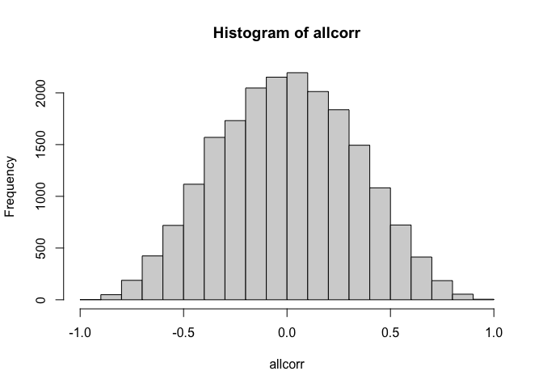<!-- -->

## n = 100

``` r
set.seed(21)
n <- 100 # sample size
rho <- 0 # effect size
p <- 20000 # number of simulations
allcorr <- replicate(p, cor(MASS::mvrnorm(n = n, mu = c(0,0), Sigma = matrix(c(1, rho, rho, 1), nrow = 2, byrow = TRUE)))[1,2])
# plot histogram
hist(allcorr, xlim = c(-1, 1))
```

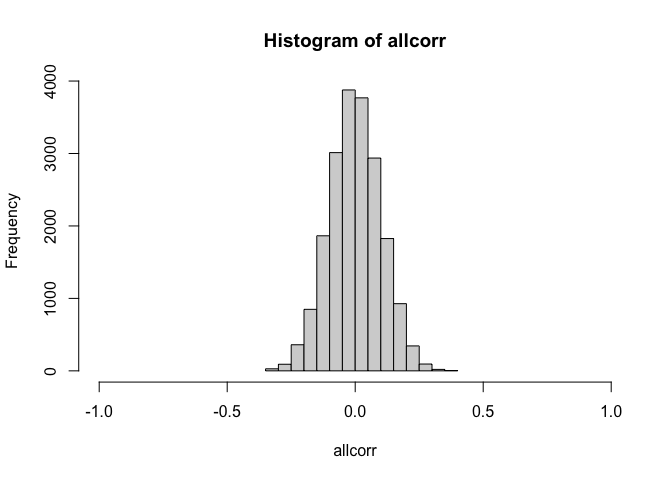<!-- -->

# Fake correlation

Generate 20 variables, pick largest bivariate correlation, plot it.

``` r
n_var <- 20
mu <- rep(0, n_var)
sigma <- diag(x = 1, n_var, n_var)
set.seed(123)
variables <- MASS::mvrnorm(n = 30, mu = mu, Sigma = sigma)
cor_matrix <- cor(variables)
cor_matrix[!upper.tri(cor_matrix)] <- NA
which(abs(cor_matrix) == max(abs(cor_matrix), na.rm = TRUE), arr.ind = TRUE)
```

    ##      row col
    ## [1,]   3   4

``` r
plot(variables[, 3], variables[, 4])
```

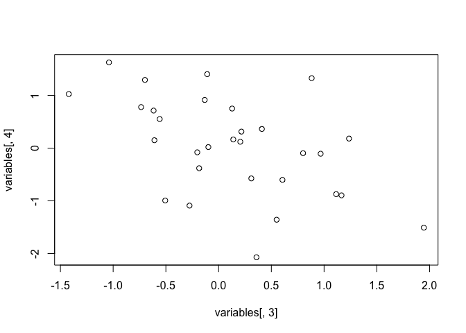<!-- -->

``` r
cor(variables[, 3], variables[, 4])
```

    ## [1] -0.5078879

``` r
cor.test(variables[, 3], variables[, 4])
```

    ## 
    ##  Pearson's product-moment correlation
    ## 
    ## data:  variables[, 3] and variables[, 4]
    ## t = -3.1198, df = 28, p-value = 0.004167
    ## alternative hypothesis: true correlation is not equal to 0
    ## 95 percent confidence interval:
    ##  -0.7338753 -0.1806786
    ## sample estimates:
    ##        cor 
    ## -0.5078879

``` r
out <- cor.test(variables[, 3], variables[, 4])

df <- tibble(x=variables[, 3], y=variables[, 4])

ggplot(data=df, aes(x=x, y=y)) + theme_classic() +
  geom_smooth(method=lm) +
  geom_point(shape=21, size=3, fill="grey10", alpha=0.8) +
  coord_cartesian(xlim=c(-2.5, 2.5), ylim=c(-2.5, 2.5)) +
  theme(plot.title = element_text(size=20),
        axis.title.x = element_text(size = 18),
        axis.text = element_text(size = 14, colour="black"),
        axis.title.y = element_text(size = 18),
        legend.key.width = unit(1.5,"cm"),
        legend.position = "right",
        legend.text=element_text(size = 16),
        legend.title=element_text(size = 18),
        panel.background = element_rect(fill="white")) +
  labs(x = "Variable 1", y = "Variable 2") +
  # guides(colour = guide_legend(override.aes = list(size=3), # make thicker legend lines
  #   title = "Precision \n(within +/-)")) + # change legend title
  ggtitle(paste0("r=",round(out$estimate,digits = 2),
                 ", t=",round(out$statistic,digits = 2),
                 ", p=",round(out$p.value,digits = 4))) 
```

    ## `geom_smooth()` using formula = 'y ~ x'

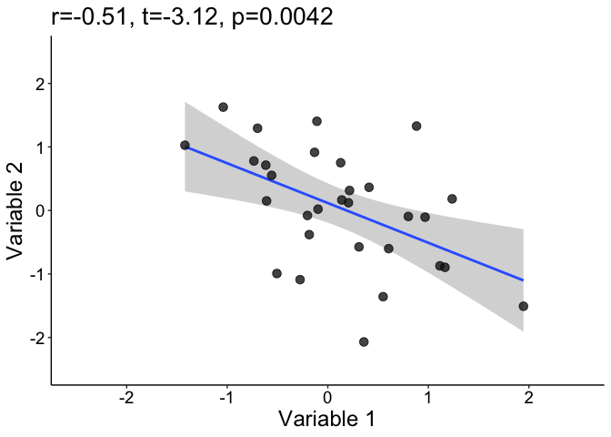<!-- -->

Save figure

``` r
ggsave(filename='./figures/fig_rand_corr.tiff',width=7, height=5, dpi=300) 
```

# Correlation estimates as a function of sample size

## Parameters

``` r
nseq <- c(seq(10, 100, 10), 150, 200, 300) # sample sizes
Nn <- length(nseq)
pts <- seq(-1, 1, 0.025) # KDE points
Np <- length(pts)
preseq <- seq(0.025, 0.2, 0.025) # precision bounds
Npre <- length(preseq)
rho <- 0
p <- 200 # 19900 correlations - sum(upper.tri(matrix(0, p, p), diag = FALSE))
Nsim <- 20000
```

## Generate data

``` r
set.seed(21)
# declare result matrices
res.cor <- matrix(data = 0, nrow = Np, ncol = Nn) 
res.pre <- matrix(data = 0, nrow = Npre, ncol = Nn)

for(iter.n in 1:Nn){
  beep(2)
  print(paste0("Sample size = ", nseq[iter.n]))
  
  allcorr <- replicate(Nsim, cor(MASS::mvrnorm(n = nseq[iter.n], mu = c(0,0), Sigma = matrix(c(1, rho, rho, 1), nrow = 2, byrow = TRUE)))[1,2])
  
res.cor[,iter.n] <- akerd(allcorr, pyhat=TRUE, pts=pts, plotit=FALSE)
  
  # Probability of getting estimate within +/- x of population value
  for(iter.p in 1:Npre){
    res.pre[iter.p, iter.n] <- mean(allcorr <= (rho + preseq[iter.p]) & allcorr >= (rho - preseq[iter.p]))
  }
  
}

save(res.cor, res.pre,
     file = "./data/samp_dist.RData")
beep(8)
```

Wolfgang Viechtbauer mentioned on
[Twitter](https://twitter.com/wviechtb/status/1002875957374521346) “that
one can just compute the density of r directly (no need to simulate).
For example:
[link](https://gist.github.com/wviechtb/e87ee35ea5544a3a5f875f61e270cd18).
Then everything is nice and smooth”. Here we use simulations because the
code could be modified to include data that are not bivariate normal,
for instance with heteroscedasticity. See example code using conditional
variances
[here](https://www.r-bloggers.com/simulating-from-the-bivariate-normal-distribution-in-r)
and in the `corr_power.Rmd` file.

## Plot kernel density estimates

``` r
# get data
load("./data/samp_dist.RData")

# plot only a subsample of sizes:
toget <- c(1,2,3,4,5,7,10,11,13) # seq(1:Nn)

# make data frame
fm <- array(0, dim = c(Np, length(toget)+1)) # make full matrix
fm[,1] <- pts
fm[,2:(length(toget)+1)] <- res.cor[, toget]
colnames(fm) <- c("x",nseq[toget])
df <- as_tibble(fm)
df <- tidyr::gather(df, SS, Density,2:(length(toget)+1))
df[[2]] <- as.character(df[[2]])
df[[2]] <- factor(df[[2]], levels=unique(df[[2]]))

# make plot
p <- ggplot(df, aes(x, Density)) + theme_classic() +
          geom_line(aes(colour = SS), linewidth = 1)  + 
          scale_color_viridis_d(option = "B", end = 0.9) + 
          theme(axis.title.x = element_text(size = 18),
                axis.text = element_text(size = 14, colour = "black"),
                axis.title.y = element_text(size = 18),
                axis.text.y = element_blank(),
                axis.ticks.y = element_blank(),
                panel.grid.minor.y = element_blank(),
                legend.key.width = unit(1.5,"cm"),
                legend.text = element_text(size = 16),
                legend.title = element_text(size = 18),
                legend.position = c(.85, .55),
                plot.title = element_text(size = 20, colour = "black"),
                panel.background = element_rect(fill="grey90")) +
          scale_x_continuous(limits = c(-1, 1), 
                             breaks = seq(-1, 1, 0.2)) +
  labs(x = "Correlation estimates", y = "Density") +
  # ggtitle("Correlation sampling distributions") +
  ggtitle("\u03c1=0") +
  # ggtitle("rho=0") +
  guides(colour = guide_legend(override.aes = list(linewidth=3), # make thicker legend lines
        title="Sample size")) # change legend title
```

    ## Warning: A numeric `legend.position` argument in `theme()` was deprecated in ggplot2
    ## 3.5.0.
    ## ℹ Please use the `legend.position.inside` argument of `theme()` instead.
    ## This warning is displayed once every 8 hours.
    ## Call `lifecycle::last_lifecycle_warnings()` to see where this warning was
    ## generated.

``` r
p.sd <- p
p
```

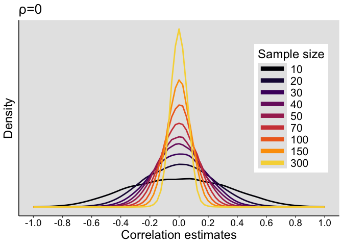<!-- -->

#### Mean and median correlations

``` r
load("./data/rpval_04.RData")
round(apply(res.r, 2, mean), digits = 3)
```

    ##  [1] 0.381 0.391 0.394 0.395 0.396 0.397 0.398 0.397 0.398 0.397 0.399 0.400
    ## [13] 0.400

``` r
round(apply(res.r, 2, median), digits = 3)
```

    ##  [1] 0.423 0.409 0.407 0.404 0.403 0.403 0.402 0.402 0.402 0.401 0.402 0.401
    ## [13] 0.400

``` r
round(apply(res.r, 2, Mode), digits = 3)
```

    ##  [1] 0.490 0.348 0.609 0.508 0.403 0.254 0.408 0.269 0.379 0.591 0.374 0.368
    ## [13] 0.462

## Correlations conditional on p values

Reporting correlation results conditional on statistical significance
($p\leq0.05$) leads to inflated effect size estimation in the
literature. This estimation bias increases with lower sample sizes.

### Parameters

``` r
nseq <- c(seq(10, 100, 10), 150, 200, 300) # sample sizes
Nn <- length(nseq)
pts <- seq(-1, 1, 0.025) # KDE points
Np <- length(pts)
p <- 2
mu <- 0
nsim <- 50000
rho <- 0
sigma <- diag(p)
sigma[sigma==0] <- rho
```

### Simulation

``` r
set.seed(21)

res.r <- matrix(data = 0, nrow = nsim, ncol = Nn) # R values
res.p <- matrix(data = 0, nrow = nsim, ncol = Nn) # p values

for(iter.n in 1:Nn){
  beep(2)
  print(paste0("Sample size = ", nseq[iter.n]))
  
  for(iter in 1:nsim){
    
    data <- MASS::mvrnorm(n = nseq[iter.n], mu = rep(mu, p), Sigma = sigma)
    out <- cor.test(data[,1],data[,2], method = "pearson")
    res.r[iter,iter.n] <- out$estimate
    res.p[iter,iter.n] <- out$p.value

  }
}

# hist(res.r)
# mean(res.p<=0.05)

save(res.r, res.p,
     file = "./data/rpval.RData")
beep(8)
```

### Make KDE

``` r
# get data
load("./data/rpval.RData")

kde.r.ori <- matrix(data = 0, nrow = Np, ncol = Nn) 
kde.r.cond <- matrix(data = 0, nrow = Np, ncol = Nn) 

for(iter.n in 1:Nn){
  beep(2)
  print(paste0("Sample size = ", nseq[iter.n]))
  
  kde.r.ori[,iter.n] <- akerd(res.r[,iter.n], pyhat=TRUE, pts=pts, plotit=FALSE)
  kde.r.cond[,iter.n] <- akerd(res.r[res.p[,iter.n]<=0.05,iter.n], pyhat=TRUE, pts=pts, plotit=FALSE)
  
}

save(kde.r.ori, kde.r.cond,
     file = "./data/rpval.kde.RData")
beep(8)
```

### Plot KDE of conditional correlation estimates

``` r
# get data
load("./data/rpval.kde.RData")

# make data frame
fm <- array(0, dim = c(Np, length(toget)+1)) # make full matrix
fm[,1] <- pts
fm[,2:(length(toget)+1)] <- kde.r.cond[,toget]
colnames(fm) <- c("x",nseq[toget])
df <- as_tibble(fm)
df <- tidyr::gather(df, SS, Density,2:(length(toget)+1))
df[[2]] <- as.character(df[[2]])
df[[2]] <- factor(df[[2]], levels=unique(df[[2]]))

# make plot
p <- ggplot(df, aes(x, Density)) + theme_classic() +
          geom_line(aes(colour = SS), linewidth = 1)  + 
          scale_color_viridis_d(option = "B", end = 0.9) + 
          theme(axis.title.x = element_text(size = 18),
                axis.text = element_text(size = 14, colour = "black"),
                axis.title.y = element_text(size = 18),
                axis.text.y = element_blank(),
                axis.ticks.y = element_blank(),
                panel.grid.minor.y = element_blank(),
                legend.key.width = unit(1.5,"cm"),
                legend.text = element_text(size = 16),
                legend.title = element_text(size = 18),
                legend.position = "none",
                plot.title = element_text(size = 20, colour = "black"),
                panel.background = element_rect(fill="grey90")) +
          scale_x_continuous(limits = c(-1, 1), 
                             breaks = seq(-1, 1, 0.2)) +
  labs(x = "Correlation estimates", y = "Density") +
  ggtitle("\u03c1=0: p\u22640.05") +
  # ggtitle("rho=0: p<=0.05") +
  # ggtitle("Correlation sampling distributions") +
  guides(colour = guide_legend(override.aes = list(linewidth=3), # make thicker legend lines
        title="Sample size")) # change legend title
p
```

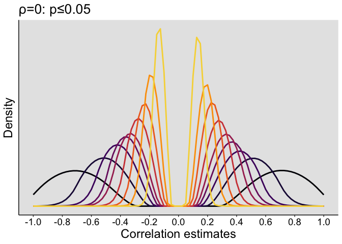<!-- -->

``` r
p.csd <- p
```

## Estimation precision (rho=0)

``` r
df <- tibble(`Proportion` = as.vector(res.pre),
             `Precision` = rep(preseq, Nn),
             `Size` = rep(nseq, each = Npre))

df$Precision <- as.character(df$Precision)
df$Precision <- factor(df$Precision, levels=unique(df$Precision))

# data frame to plot segments
tmp.pos <- approx(y=nseq,x=res.pre[4,],xout=0.70)$y
df.seg1 <- tibble(x=0, xend=tmp.pos,
                  y=0.7, yend=0.7)
df.seg2 <- tibble(x=tmp.pos, xend=tmp.pos,
                  y=0.7, yend=0)
tmp.pos <- approx(y=nseq,x=res.pre[8,],xout=0.90)$y
df.seg3 <- tibble(x=0, xend=tmp.pos,
                  y=0.9, yend=0.9)
df.seg4 <- tibble(x=tmp.pos, xend=tmp.pos,
                  y=0.9, yend=0)

# make plot
p <- ggplot(df, aes(x=Size, y=Proportion)) + theme_classic() +
  # geom_abline(intercept=0.7, slope=0, colour="grey20") +
  geom_segment(data = df.seg1, aes(x=x, y=y, xend=xend, yend=yend)) +
  geom_segment(data = df.seg2, aes(x=x, y=y, xend=xend, yend=yend), 
               arrow = arrow(length = unit(0.2, "cm"))) +
  geom_segment(data = df.seg3, aes(x=x, y=y, xend=xend, yend=yend)) +
  geom_segment(data = df.seg4, aes(x=x, y=y, xend=xend, yend=yend), 
               arrow = arrow(length = unit(0.2, "cm"))) +
  geom_line(aes(colour = Precision), linewidth=1) + 
  scale_color_viridis_d(end = 0.9) +
  scale_x_continuous(breaks=nseq, 
            labels = c("10",  "",  "30", "", "50",  "", "70", "", "90", "", "150", "200", "300")) + 
  scale_y_continuous(breaks=seq(0, 1, 0.1)) +
  coord_cartesian(ylim=c(0, 1)) +
  theme(plot.title = element_text(size=20),
        axis.title.x = element_text(size = 18),
        axis.text = element_text(size = 14, colour="black"),
        axis.title.y = element_text(size = 18),
        legend.key.width = unit(1.5,"cm"),
        legend.position = "right",
        legend.text=element_text(size = 16),
        legend.title=element_text(size = 18),
        panel.background = element_rect(fill="grey90")) +
  labs(x = "Sample size", y = "Proportion of estimates") +
  guides(colour = guide_legend(override.aes = list(linewidth=3), # make thicker legend lines
    title = "Precision \n(within +/-)")) + # change legend title
  ggtitle("Estimation precision (\u03c1=0)")
  # ggtitle("Estimation precision (rho=0)") 
p
```

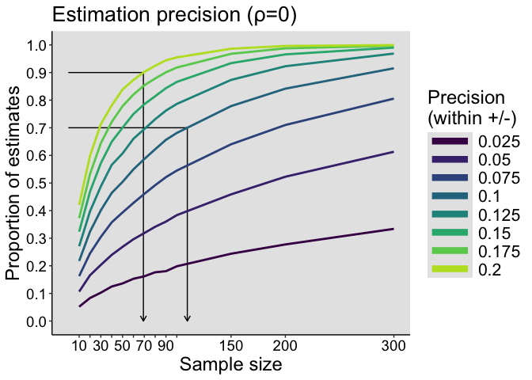<!-- -->

``` r
p.precision <- p
```

For 70% of estimates to be within +/- 0.1 of the true correlation value
(between -0.1 and 0.1), we need at least 110 observations.

For 90% of estimates to be within +/- 0.2 of the true correlation value
(between -0.2 and 0.2), we need at least 69 observations.

# Probability to replicate an effect

For a given precision, what is the probability to observe similar
effects in two consecutive experiments? In other words, what is the
probability that two measurements differ by at most a certain amount?

## Parameters

``` r
nseq <- c(seq(10, 100, 10), 150, 200, 300) # sample sizes
Nn <- length(nseq)
preseq <- seq(0.025, 0.2, 0.025) # precision bounds
Npre <- length(preseq)
g <- 0
h <- 0
rho <- 0
p <- 500 # 124750 correlations - sum(upper.tri(matrix(0, p, p), diag = FALSE))
Nsim <- 20000
```

## Generate data

``` r
set.seed(21)
# declare result matrices
res.rep <- matrix(data = 0, nrow = Npre, ncol = Nn)

for(iter.n in 1:Nn){
  beep(2)
  print(paste0("Sample size = ", nseq[iter.n]))
 
   allcorr1 <- replicate(Nsim, cor(MASS::mvrnorm(n = nseq[iter.n], mu = c(0,0), Sigma = matrix(c(1, rho, rho, 1), nrow = 2, byrow = TRUE)))[1,2])
  
  allcorr2 <- replicate(Nsim, cor(MASS::mvrnorm(n = nseq[iter.n], mu = c(0,0), Sigma = matrix(c(1, rho, rho, 1), nrow = 2, byrow = TRUE)))[1,2])
  
  # Probability of getting estimates at most x units of each other
  for(iter.p in 1:Npre){
    res.rep[iter.p, iter.n] <- mean( abs(allcorr1-allcorr2) <= (preseq[iter.p]*2) )
  }
  
}

save(res.rep,
     file = "./data/replication.RData")
beep(8)
```

## Illustrate results

``` r
load("./data/replication.RData")
df <- tibble(`Proportion` = as.vector(res.rep),
             `Precision` = rep(preseq*2, Nn),
             `Size` = rep(nseq, each = Npre))

df$Precision <- as.character(df$Precision)
df$Precision <- factor(df$Precision, levels=unique(df$Precision))

# data frame to plot segments
tmp.pos <- approx(y=nseq,x=res.rep[4,],xout=0.8)$y
df.seg1 <- tibble(x=0, xend=tmp.pos,
                  y=0.8, yend=0.8)
df.seg2 <- tibble(x=tmp.pos, xend=tmp.pos,
                  y=0.8, yend=0)

# make plot
p <- ggplot(df, aes(x=Size, y=Proportion)) + theme_classic() +
  geom_segment(data = df.seg1, aes(x=x, y=y, xend=xend, yend=yend)) +
  geom_segment(data = df.seg2, aes(x=x, y=y, xend=xend, yend=yend),
               arrow = arrow(length = unit(0.2, "cm"))) +
  geom_line(aes(colour = Precision), linewidth=1) + 
  scale_color_viridis_d(end = 0.9) +
  scale_x_continuous(breaks=nseq, 
            labels = c("10",  "",  "30", "", "50",  "", "70", "", "90", "", "150", "200", "300")) + 
  scale_y_continuous(breaks=seq(0, 1, 0.1)) +
  coord_cartesian(ylim=c(0, 1)) +
  theme(plot.title = element_text(size=20),
        axis.title.x = element_text(size = 18),
        axis.text = element_text(size = 14, colour="black"),
        axis.title.y = element_text(size = 18),
        legend.key.width = unit(1.5,"cm"),
        legend.position = "right",
        legend.text=element_text(size = 16),
        legend.title=element_text(size = 18),
        panel.background = element_rect(fill="grey90")) +
  labs(x = "Sample size", y = "Proportion of replications") +
  guides(colour = guide_legend(override.aes = list(linewidth=3), # make thicker legend lines
    title = "Difference \n(at most)")) + # change legend title
  ggtitle("Replication precision") 
p
```

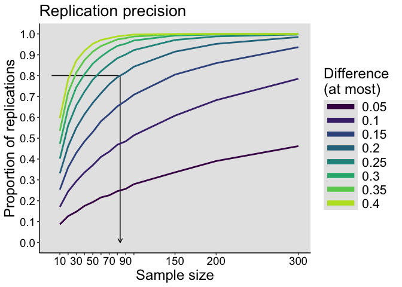<!-- -->

``` r
p.replication <- p
# save figure
# ggsave(filename='./figures/figure_replication.pdf',width=9,height=5) 
```

For 80% of replications to be at most 0.2 apart, we need at least 83
observations.

What happens when there is an effect?

# Correlation estimates as a function of rho for fixed n

For a given sample size, estimate correlations for different Pearson’s
population (rho) correlations.

## Parameters

``` r
n <- 30 # sample size
rhoseq <- seq(0, 0.9, 0.1) # rho
Nrho <- length(rhoseq)
pts <- seq(-1, 1, 0.025) # KDE points
Np <- length(pts)
preseq <- seq(0.025, 0.2, 0.025) # precision bounds
Npre <- length(preseq)
# rho <- 0
p <- 200 # 19900 correlations - sum(upper.tri(matrix(0, p, p), diag = FALSE))
Nsim <- 20000
```

## Generate data

``` r
set.seed(666)
# declare result matrices
res.cor <- matrix(data = 0, nrow = Np, ncol = Nrho)
res.pre <- matrix(data = 0, nrow = Npre, ncol = Nrho)

for(iter.rho in 1:Nrho){
  beep(2)
  print(paste0("rho = ", rhoseq[iter.rho]))
  
  allcorr <- replicate(Nsim, cor(MASS::mvrnorm(n = n, mu = c(0,0), Sigma = matrix(c(1, rhoseq[iter.rho], rhoseq[iter.rho], 1), nrow = 2, byrow = TRUE)))[1,2])
  
  res.cor[,iter.rho] <- akerd(allcorr, pyhat=TRUE, pts=pts, plotit=FALSE)
  
  # Probability of getting estimate within +/- x of population value
  for(iter.p in 1:Npre){
    res.pre[iter.p, iter.rho] <- mean( (allcorr-rhoseq[iter.rho]) <= (preseq[iter.p]) & (allcorr-rhoseq[iter.rho]) >= (-1*preseq[iter.p]))
  }
  
}

save(res.cor, res.pre,
     file = "./data/samp_dist_rho.RData")
beep(8)
```

## Plot kernel density estimates

``` r
# get data
load("./data/samp_dist_rho.RData")

# make data frame
fm <- array(0, dim = c(Np, Nrho+1)) # make full matrix
fm[,1] <- pts
fm[,2:(Nrho+1)] <- res.cor
colnames(fm) <- c("x",rhoseq)
df <- as_tibble(fm)
df <- tidyr::gather(df, RHO, Density,2:(Nrho+1))
df[[2]] <- as.character(df[[2]])
df[[2]] <- factor(df[[2]], levels=unique(df[[2]]))

# make plot
p <- ggplot(df, aes(x, Density)) + theme_classic() +
          geom_line(aes(colour = RHO), linewidth = 1)  + 
          scale_color_viridis_d(option = "C", end = 0.9) + 
          theme(axis.title.x = element_text(size = 18),
                axis.text = element_text(size = 14, colour = "black"),
                axis.title.y = element_text(size = 18),
                axis.text.y = element_blank(),
                axis.ticks.y = element_blank(),
                panel.grid.minor.y = element_blank(),
                legend.key.width = unit(1.5,"cm"),
                legend.text = element_text(size = 16),
                legend.title = element_text(size = 18),
                legend.position = "right",
                plot.title = element_text(size = 20, colour = "black"),
                panel.background = element_rect(fill="grey90")) +
          scale_x_continuous(limits = c(-1, 1), 
                             breaks = seq(-1, 1, 0.2)) +
  labs(x = "Correlation estimates", y = "Density") +
  ggtitle("Correlation sampling distributions (n=30)") +
  guides(colour = guide_legend(override.aes = list(linewidth=3), # make thicker legend lines
        title="Population \ncorrelation")) # change legend title
p
```

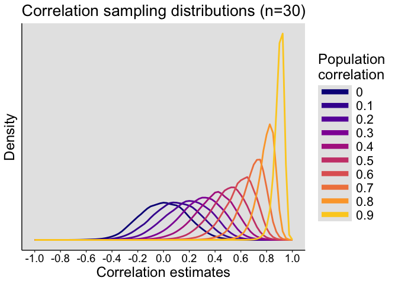<!-- -->

``` r
# save figure
# ggsave(filename='./figures/figure_samp_dist_rho.pdf',width=9,height=5) 
```

## Precision

``` r
df <- tibble(`Proportion` = as.vector(res.pre),
             `Precision` = rep(preseq, Nrho),
             `Rho` = rep(rhoseq, each = Npre))

df$Precision <- as.character(df$Precision)
df$Precision <- factor(df$Precision, levels=unique(df$Precision))

# make plot
p <- ggplot(df, aes(x=Rho, y=Proportion)) + theme_classic() +
  geom_line(aes(colour = Precision), linewidth = 1) + 
  scale_color_viridis_d(end = 0.9) +
  scale_x_continuous(breaks=rhoseq) + 
  scale_y_continuous(breaks=seq(0, 1, 0.1)) +
  coord_cartesian(ylim=c(0, 1)) +
  theme(plot.title = element_text(size=20),
        axis.title.x = element_text(size = 18),
        axis.text = element_text(size = 14, colour="black"),
        axis.title.y = element_text(size = 18),
        legend.key.width = unit(1.5,"cm"),
        legend.position = "right",
        legend.text=element_text(size = 16),
        legend.title=element_text(size = 18),
        panel.background = element_rect(fill="grey90")) +
  labs(x = "Population correlation", y = "Proportion of estimates") +
  guides(colour = guide_legend(override.aes = list(linewidth=3), # make thicker legend lines
    title = "Precision \n(within +/-)")) + # change legend title
  ggtitle("Measurement precision (n=30)") 
p
```

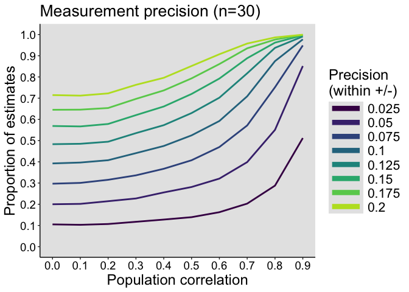<!-- -->

``` r
# save figure
# ggsave(filename='./figures/figure_precision_rho.pdf',width=9,height=5) 
```

Let’s look in more detail at the sampling distributions for a generous
rho = 0.4.

# Correlation estimates as a function of sample size (rho=0.4)

## Parameters

``` r
nseq <- c(seq(10, 100, 10), 150, 200, 300) # sample sizes
Nn <- length(nseq)
pts <- seq(-1, 1, 0.025) # KDE points
Np <- length(pts)
preseq <- seq(0.025, 0.2, 0.025) # precision bounds
Npre <- length(preseq)
rho <- 0.4
p <- 200 # 19900 correlations - sum(upper.tri(matrix(0, p, p), diag = FALSE))
Nsim <- 20000
```

## Generate data

``` r
set.seed(21)
# declare result matrices
res.cor <- matrix(data = 0, nrow = Np, ncol = Nn) 
res.pre <- matrix(data = 0, nrow = Npre, ncol = Nn)

for(iter.n in 1:Nn){
  beep(2)
  print(paste0("Sample size = ", nseq[iter.n]))
 
  allcorr <- replicate(Nsim, cor(MASS::mvrnorm(n = nseq[iter.n], mu = c(0,0), Sigma = matrix(c(1, rho, rho, 1), nrow = 2, byrow = TRUE)))[1,2])
  
  res.cor[,iter.n] <- akerd(allcorr, pyhat=TRUE, pts=pts, plotit=FALSE)
  
  # Probability of getting estimate within +/-x% of population value
  for(iter.p in 1:Npre){
    res.pre[iter.p, iter.n] <- mean((allcorr-rho) <= preseq[iter.p] & (allcorr-rho) >= (-1*preseq[iter.p]))
  }
  
}

save(res.cor, res.pre,
     file = "./data/samp_dist_rho04.RData")
beep(8)
```

## Plot kernel density estimates

``` r
# get data
load("./data/samp_dist_rho04.RData")

# make data frame
fm <- array(0, dim = c(Np, length(toget)+1)) # make full matrix
fm[,1] <- pts
fm[,2:(length(toget)+1)] <- res.cor[,toget]
colnames(fm) <- c("x",nseq[toget])
df <- as_tibble(fm)
df <- tidyr::gather(df, SS, Density,2:(length(toget)+1))
df[[2]] <- as.character(df[[2]])
df[[2]] <- factor(df[[2]], levels=unique(df[[2]]))

# make plot
p <- ggplot(df, aes(x, Density)) + theme_classic() +
          geom_line(aes(colour = SS), linewidth = 1)  + 
          scale_color_viridis_d(option = "B", end = 0.9) + 
          theme(axis.title.x = element_text(size = 18),
                axis.text = element_text(size = 14, colour = "black"),
                axis.title.y = element_text(size = 18),
                axis.text.y = element_blank(),
                axis.ticks.y = element_blank(),
                panel.grid.minor.y = element_blank(),
                legend.key.width = unit(1.5,"cm"),
                legend.text = element_text(size = 16),
                legend.title = element_text(size = 18),
                legend.position = "none",
                plot.title = element_text(size = 20, colour = "black"),
                panel.background = element_rect(fill="grey90")) +
          scale_x_continuous(limits = c(-1, 1), 
                             breaks = seq(-1, 1, 0.2)) +
  labs(x = "Correlation estimates", y = "Density") +
  # ggtitle("Correlation sampling distributions (rho=0.4)") +
  ggtitle("\u03c1=0.4") +
  # ggtitle("rho=0.4") +
  guides(colour = guide_legend(override.aes = list(linewidth=3), # make thicker legend lines
        title="Sample size")) # change legend title
p
```

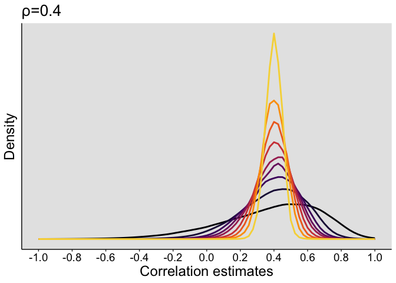<!-- -->

``` r
p.sd04 <- p

# save figure
# ggsave(filename='./figures/figure_sampling_distributions_rho04.pdf',width=9,height=5) 
```

## Correlations conditional on p values

### Parameters

``` r
nseq <- c(seq(10, 100, 10), 150, 200, 300) # sample sizes
Nn <- length(nseq)
pts <- seq(-1, 1, 0.025) # KDE points
Np <- length(pts)
p <- 2
mu <- 0
nsim <- 50000
rho <- 0.4
sigma <- diag(p)
sigma[sigma==0] <- rho
```

### Simulation

``` r
set.seed(21)

res.r <- matrix(data = 0, nrow = nsim, ncol = Nn) # R values
res.p <- matrix(data = 0, nrow = nsim, ncol = Nn) # p values

for(iter.n in 1:Nn){
  beep(2)
  print(paste0("Sample size = ", nseq[iter.n]))
  
  for(iter in 1:nsim){
    
    data <- MASS::mvrnorm(n = nseq[iter.n], mu = rep(mu, p), Sigma = sigma)
    out <- cor.test(data[,1],data[,2], method = "pearson")
    res.r[iter,iter.n] <- out$estimate
    res.p[iter,iter.n] <- out$p.value

  }
}

hist(res.r)
mean(res.p<=0.05)

save(res.r, res.p,
     file = "./data/rpval_04.RData")
beep(8)
```

Proportion of simulations with negative sign and p\<0.05 for n = 10:

``` r
load("./data/rpval_04.RData")
mean(res.r[res.p[,1]<0.05,1]<0)
```

    ## [1] 0.007681366

### Make KDE

``` r
# get data
load("./data/rpval_04.RData")

kde.r.ori <- matrix(data = 0, nrow = Np, ncol = Nn) 
kde.r.cond <- matrix(data = 0, nrow = Np, ncol = Nn) 

for(iter.n in 1:Nn){
  
  print(paste0("Sample size = ", nseq[iter.n]))
  
  kde.r.ori[,iter.n] <- akerd(res.r[,iter.n], pyhat=TRUE, pts=pts, plotit=FALSE)
  kde.r.cond[,iter.n] <- akerd(res.r[res.p[,iter.n]<=0.05,iter.n], pyhat=TRUE, pts=pts, plotit=FALSE)
  
}

save(kde.r.ori, kde.r.cond,
     file = "./data/rpval.kde_04.RData")
```

### Plot conditional correlation estimates

``` r
# get data
load("./data/rpval.kde_04.RData")

# make data frame
fm <- array(0, dim = c(Np, length(toget)+1)) # make full matrix
fm[,1] <- pts
fm[,2:(length(toget)+1)] <- kde.r.cond[,toget]
colnames(fm) <- c("x",nseq[toget])
df <- as_tibble(fm)
df <- tidyr::gather(df, SS, Density,2:(length(toget)+1))
df[[2]] <- as.character(df[[2]])
df[[2]] <- factor(df[[2]], levels=unique(df[[2]]))

# make plot
p <- ggplot(df, aes(x, Density)) + theme_classic() +
          geom_line(aes(colour = SS), linewidth = 1)  + 
          scale_color_viridis_d(option = "B", end = 0.9) + 
          theme(axis.title.x = element_text(size = 18),
                axis.text = element_text(size = 14, colour = "black"),
                axis.title.y = element_text(size = 18),
                axis.text.y = element_blank(),
                axis.ticks.y = element_blank(),
                panel.grid.minor.y = element_blank(),
                legend.key.width = unit(1.5,"cm"),
                legend.text = element_text(size = 16),
                legend.title = element_text(size = 18),
                legend.position = "none",
                plot.title = element_text(size = 20, colour = "black"),
                panel.background = element_rect(fill="grey90")) +
          scale_x_continuous(limits = c(-1, 1), 
                             breaks = seq(-1, 1, 0.2)) +
  labs(x = "Correlation estimates", y = "Density") +
  # ggtitle("Correlation sampling distributions") +
  ggtitle("\u03c1=0.4: p\u22640.05") +
  # ggtitle("rho=0.4: p<=0.05") +
  guides(colour = guide_legend(override.aes = list(linewidth=3), # make thicker legend lines
        title="Sample size")) # change legend title
p
```

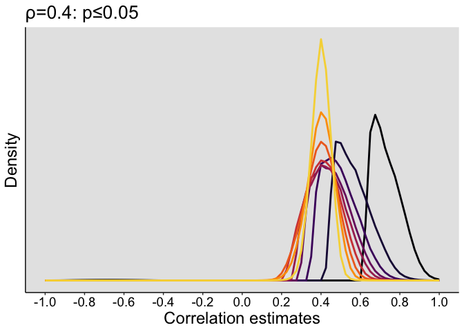<!-- -->

``` r
p.csd04 <- p

# save figure
# ggsave(filename='./figures/figure_rpval_cond_04.pdf',width=9,height=5) 
```

#### Mean and median correlations

``` r
load("./data/rpval_04.RData")

mean.res <- vector(mode = "numeric", length = Nn) 
median.res <- vector(mode = "numeric", length = Nn) 
mode.res <- vector(mode = "numeric", length = Nn) 

for(iter.n in 1:Nn){

mean.res[iter.n] <- round(mean(res.r[res.p[,iter.n]<=0.05,iter.n]), digits=3)
median.res[iter.n] <- round(median(res.r[res.p[,iter.n]<=0.05,iter.n]), digits=3)
mode.res[iter.n] <- round(Mode(res.r[res.p[,iter.n]<=0.05,iter.n]), digits=3)
}

mean.res
```

    ##  [1] 0.723 0.567 0.496 0.457 0.434 0.420 0.412 0.406 0.404 0.401 0.399 0.400
    ## [13] 0.400

``` r
median.res
```

    ##  [1] 0.721 0.553 0.485 0.449 0.429 0.417 0.411 0.406 0.404 0.402 0.402 0.401
    ## [13] 0.400

``` r
mode.res
```

    ##  [1] 0.644 0.457 0.609 0.508 0.403 0.442 0.408 0.269 0.379 0.591 0.374 0.368
    ## [13] 0.462

## Precision

``` r
df <- tibble(`Proportion` = as.vector(res.pre),
             `Precision` = rep(preseq, Nn),
             `Size` = rep(nseq, each = Npre))

df$Precision <- as.character(df$Precision)
df$Precision <- factor(df$Precision, levels=unique(df$Precision))

# data frame to plot segments
tmp.pos <- approx(y=nseq,x=res.pre[4,],xout=0.70)$y
df.seg1 <- tibble(x=0, xend=tmp.pos,
                  y=0.7, yend=0.7)
df.seg2 <- tibble(x=tmp.pos, xend=tmp.pos,
                  y=0.7, yend=0)
tmp.pos <- approx(y=nseq,x=res.pre[8,],xout=0.90)$y
df.seg3 <- tibble(x=0, xend=tmp.pos,
                  y=0.9, yend=0.9)
df.seg4 <- tibble(x=tmp.pos, xend=tmp.pos,
                  y=0.9, yend=0)

# make plot
p <- ggplot(df, aes(x=Size, y=Proportion)) + theme_classic() +
  # geom_abline(intercept=0.7, slope=0, colour="grey20") +
  geom_segment(data = df.seg1, aes(x=x, y=y, xend=xend, yend=yend)) +
  geom_segment(data = df.seg2, aes(x=x, y=y, xend=xend, yend=yend),
               arrow = arrow(length = unit(0.2, "cm"))) +
  geom_segment(data = df.seg3, aes(x=x, y=y, xend=xend, yend=yend)) +
  geom_segment(data = df.seg4, aes(x=x, y=y, xend=xend, yend=yend),
               arrow = arrow(length = unit(0.2, "cm"))) +
  geom_line(aes(colour = Precision), linewidth = 1) + 
  scale_color_viridis_d(end = 0.9) +
  scale_x_continuous(breaks=nseq, 
            labels = c("10",  "",  "30", "", "50",  "", "70", "", "90", "", "150", "200", "300")) + 
  scale_y_continuous(breaks=seq(0, 1, 0.1)) +
  coord_cartesian(ylim=c(0, 1)) +
  theme(plot.title = element_text(size=20),
        axis.title.x = element_text(size = 18),
        axis.text = element_text(size = 14, colour="black"),
        axis.title.y = element_text(size = 18),
        legend.key.width = unit(1.5,"cm"),
        legend.position = "right",
        legend.text=element_text(size = 16),
        legend.title=element_text(size = 18),
        panel.background = element_rect(fill="grey90")) +
  labs(x = "Sample size", y = "Proportion of estimates") +
  guides(colour = guide_legend(override.aes = list(linewidth=3), # make thicker legend lines
    title = "Precision \n(within +/-)")) + # change legend title
  # ggtitle("Measurement precision (\u03c1=0.4)") 
  ggtitle("Measurement precision (rho=0.4)") 
p
```

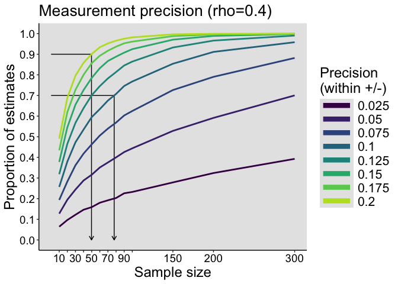<!-- -->

``` r
# save figure
# ggsave(filename='./figures/figure_precision_rho04.pdf',width=9,height=5) 
```

For 70% of estimates to be within +/- 0.1 of the true correlation value
(between 0.3 and 0.5), we need at least 78 observations.

For 90% of estimates to be within +/- 0.2 of the true correlation value
(between 0.2 and 0.6), we need at least 50 observations.

# Probability to replicate an effect (rho=0.4)

For a given precision, what is the probability to observe similar
effects in two consecutive experiments? In other words, what is the
probability that two measurements differ by at most a certain amount?

## Parameters

``` r
nseq <- c(seq(10, 100, 10), 150, 200, 300) # sample sizes
Nn <- length(nseq)
preseq <- seq(0.025, 0.2, 0.025) # precision bounds
Npre <- length(preseq)
g <- 0
h <- 0
rho <- 0.4
p <- 500 # 124750 correlations - sum(upper.tri(matrix(0, p, p), diag = FALSE))
Nsim <- 20000
```

## Generate data

``` r
set.seed(21)
# declare result matrices
res.rep <- matrix(data = 0, nrow = Npre, ncol = Nn)

for(iter.n in 1:Nn){
  beep(2)
  print(paste0("Sample size = ", nseq[iter.n]))
  allcorr1 <- replicate(Nsim, cor(MASS::mvrnorm(n = nseq[iter.n], mu = c(0,0), Sigma = matrix(c(1, rho, rho, 1), nrow = 2, byrow = TRUE)))[1,2])
  
  allcorr2 <- replicate(Nsim, cor(MASS::mvrnorm(n = nseq[iter.n], mu = c(0,0), Sigma = matrix(c(1, rho, rho, 1), nrow = 2, byrow = TRUE)))[1,2])
  
  # Probability of getting estimates at most x units of each other
  for(iter.p in 1:Npre){
    res.rep[iter.p, iter.n] <- mean( abs(allcorr1-allcorr2) <= (preseq[iter.p]*2) )
  }
  
}

save(res.rep,
     file = "./data/replication_rho04.RData")
beep(8)
```

## Illustrate results

``` r
load("./data/replication_rho04.RData")
df <- tibble(`Proportion` = as.vector(res.rep),
             `Precision` = rep(preseq*2, Nn),
             `Size` = rep(nseq, each = Npre))

df$Precision <- as.character(df$Precision)
df$Precision <- factor(df$Precision, levels=unique(df$Precision))

# data frame to plot segments
tmp.pos <- approx(y=nseq,x=res.rep[4,],xout=0.8)$y
df.seg1 <- tibble(x=0, xend=tmp.pos,
                  y=0.8, yend=0.8)
df.seg2 <- tibble(x=tmp.pos, xend=tmp.pos,
                  y=0.8, yend=0)

# make plot
p <- ggplot(df, aes(x=Size, y=Proportion)) + theme_classic() +
  geom_segment(data = df.seg1, aes(x=x, y=y, xend=xend, yend=yend)) +
  geom_segment(data = df.seg2, aes(x=x, y=y, xend=xend, yend=yend),
               arrow = arrow(length = unit(0.2, "cm"))) +
  geom_line(aes(colour = Precision), linewidth = 1) + 
  scale_color_viridis_d(end = 0.9) +
  scale_x_continuous(breaks=nseq, 
            labels = c("10",  "",  "30", "", "50",  "", "70", "", "90", "", "150", "200", "300")) + 
  scale_y_continuous(breaks=seq(0, 1, 0.1)) +
  coord_cartesian(ylim=c(0, 1)) +
  theme(plot.title = element_text(size=20),
        axis.title.x = element_text(size = 18),
        axis.text = element_text(size = 14, colour="black"),
        axis.title.y = element_text(size = 18),
        legend.key.width = unit(1.5,"cm"),
        legend.position = "right",
        legend.text=element_text(size = 16),
        legend.title=element_text(size = 18),
        panel.background = element_rect(fill="grey90")) +
  labs(x = "Sample size", y = "Proportion of replications") +
  guides(colour = guide_legend(override.aes = list(linewidth=3), # make thicker legend lines
    title = "Difference \n(at most)")) + # change legend title
  # ggtitle("Replication precision (\u03c1=0.4)") 
ggtitle("Replication precision (rho=0.4)") 
p
```

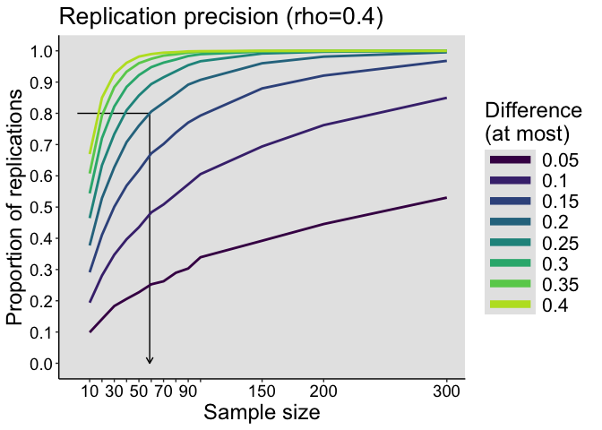<!-- -->

``` r
# save figure
# ggsave(filename='./figures/figure_replication_rho04.pdf',width=9,height=5) 
```

For 80% of replications to be at most 0.2 apart, we need at least 59
observations.

# Summary figures

## Sampling distributions

``` r
# combine panels into one figure
cowplot::plot_grid(p.sd,  p.sd04, p.csd, p.csd04,
                          labels = c("A", "C", "B", "D"),
                          ncol = 2,
                          nrow = 2,
                          rel_widths = c(1, 1, 1, 1), 
                          label_size = 20, 
                          hjust = -0.5, 
                          scale=.95,
                          align = "h")
# save figure
ggsave(filename=('./figures/fig_samp_dist.pdf'), width=15, height=12, device = cairo_pdf)
# ggsave(filename=('./figures/fig_samp_dist.tiff'), width=15, height=12, dpi=300)
# then save to tiff -- don't know how to get rid of the grey background in the tiff file.
```

## Precision & replication

Not included in article.

``` r
# combine panels into one figure
cowplot::plot_grid(p.precision,  p.replication,
                          labels = c("A", "B"),
                          ncol = 1,
                          nrow = 2,
                          rel_widths = c(1, 1), 
                          label_size = 20, 
                          hjust = -0.5, 
                          scale=.95,
                          align = "h")
# save figure
ggsave(filename=('./figures/figure_prec_rep.pdf'),
       width=7, height=10, device = cairo_pdf)
```
