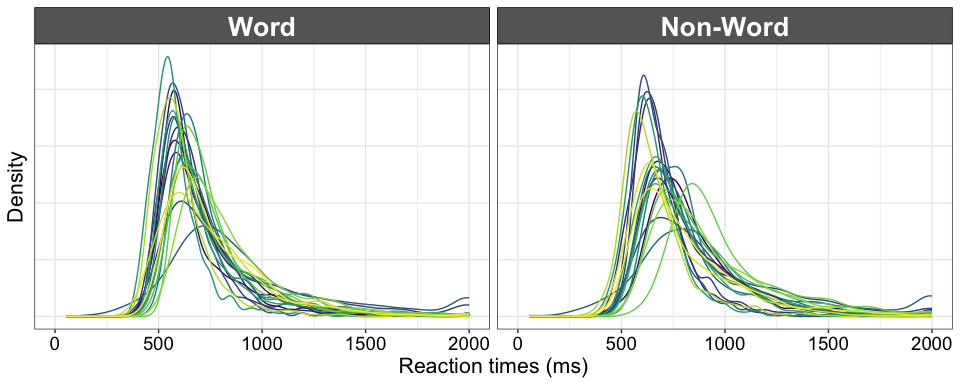
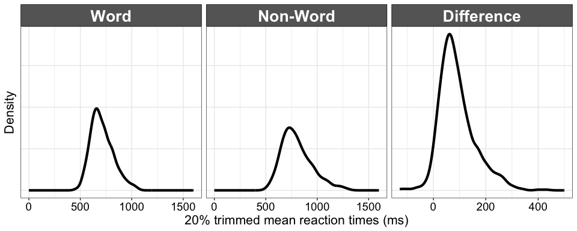
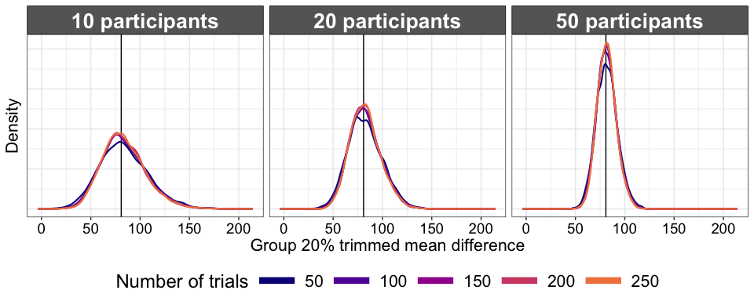
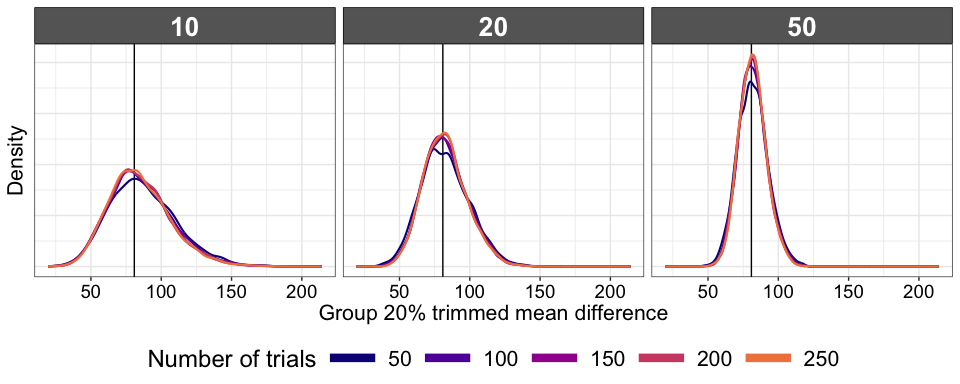
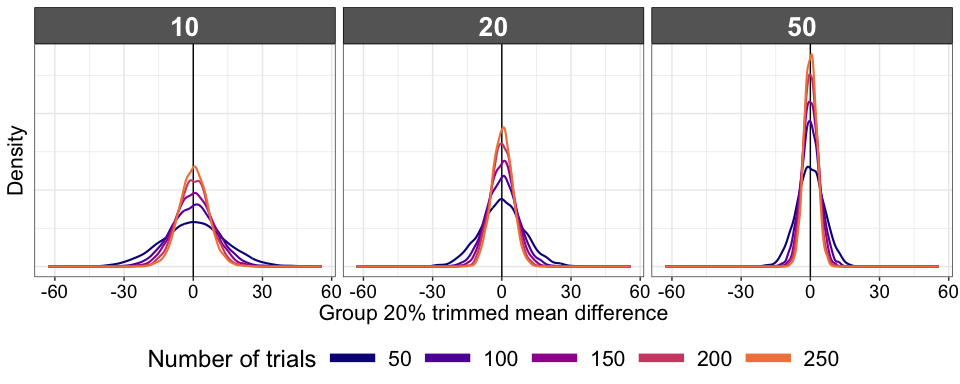
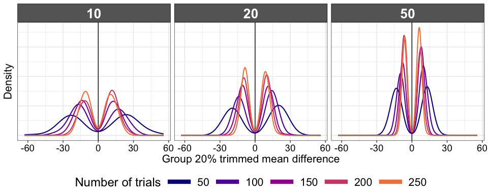
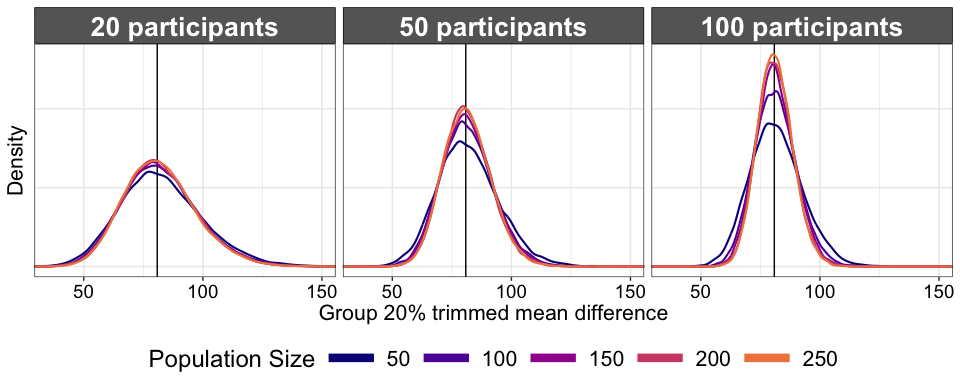
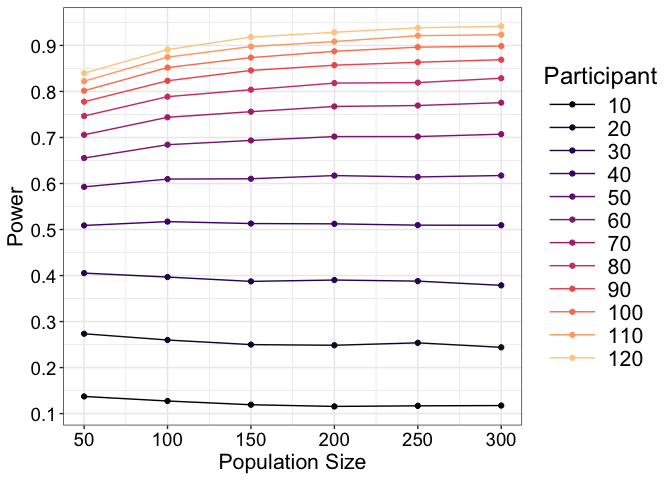
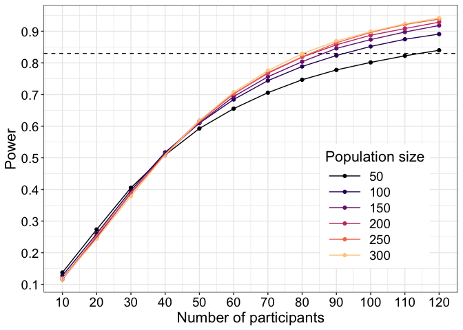

Sampling distributions for reaction time data and a warning about
data-driven simulations
================
Guillaume A. Rousselet
2025-09-09

- [Dependencies](#dependencies)
- [Illustrate random sample of
  participants](#illustrate-random-sample-of-participants)
  - [Create data frame](#create-data-frame)
  - [Make figure](#make-figure)
- [Summary results for all
  participants](#summary-results-for-all-participants)
  - [Compute trimmed means](#compute-trimmed-means)
  - [Illustrate results](#illustrate-results)
- [Hierarchical sampling: effect](#hierarchical-sampling-effect)
  - [Illustrate results](#illustrate-results-1)
- [Hierarchical sampling: no effect](#hierarchical-sampling-no-effect)
  - [Illustrate results](#illustrate-results-2)
  - [Summary figure](#summary-figure)
- [Effect of population size on sampling
  distributions](#effect-of-population-size-on-sampling-distributions)
  - [Sampling distributions](#sampling-distributions)
  - [Power](#power)
  - [Power for the full sample size](#power-for-the-full-sample-size)
  - [Summary figure](#summary-figure-1)

# Dependencies

``` r
library(ggplot2)
source("./functions/theme_gar.txt") # define ggplot theme
source("./functions/trimpval.txt") # get one-sample t-test on trimmed means
source("./functions/functions.txt")
library(tibble)
library(cowplot)
library(rogme) # this package is not on CRAN, follow these steps to install it:
# install.packages("devtools")
# devtools::install_github("GRousselet/rogme")
library(beepr)
```

``` r
sessionInfo()
```

    ## R version 4.2.2 (2022-10-31)
    ## Platform: x86_64-apple-darwin17.0 (64-bit)
    ## Running under: macOS Big Sur ... 10.16
    ## 
    ## Matrix products: default
    ## BLAS:   /Library/Frameworks/R.framework/Versions/4.2/Resources/lib/libRblas.0.dylib
    ## LAPACK: /Library/Frameworks/R.framework/Versions/4.2/Resources/lib/libRlapack.dylib
    ## 
    ## locale:
    ## [1] en_US.UTF-8/en_US.UTF-8/en_US.UTF-8/C/en_US.UTF-8/en_US.UTF-8
    ## 
    ## attached base packages:
    ## [1] stats     graphics  grDevices utils     datasets  methods   base     
    ## 
    ## other attached packages:
    ## [1] beepr_1.3     rogme_0.2.1   cowplot_1.1.1 tibble_3.2.1  ggplot2_3.5.1
    ## 
    ## loaded via a namespace (and not attached):
    ##  [1] rstudioapi_0.14   knitr_1.50        magrittr_2.0.3    tidyselect_1.2.1 
    ##  [5] munsell_0.5.1     colorspace_2.1-1  R6_2.6.1          rlang_1.1.5      
    ##  [9] fastmap_1.2.0     stringr_1.5.1     dplyr_1.1.4       tools_4.2.2      
    ## [13] grid_4.2.2        gtable_0.3.6      xfun_0.51         audio_0.1-10     
    ## [17] cli_3.6.4         withr_3.0.2       htmltools_0.5.8.1 yaml_2.3.10      
    ## [21] digest_0.6.37     lifecycle_1.0.4   vctrs_0.6.5       glue_1.8.0       
    ## [25] evaluate_1.0.3    rmarkdown_2.29    stringi_1.8.3     compiler_4.2.2   
    ## [29] pillar_1.10.1     generics_0.1.3    scales_1.3.0      pkgconfig_2.0.3

Before we conduct an experiment, we decide on a number of trials per
condition, and a number of participants, and then we hope that whatever
we measure comes close to the population values we want to estimate.
Using a large dataset, we can perform data-driven simulations to
illustrate how close we can get to the truth.

We use data from the [French Lexicon
Project](https://sites.google.com/site/frenchlexicon/results). Click on
“French Lexicon Project trial-level results with R scripts.zip”. The
`.RData` dataset was created by applying the script `getflprtdata.Rmd`
available on
[GitHub](https://github.com/GRousselet/rogme/tree/master/data-raw).

``` r
# get data - tibble = `flp`
flp <- rogme::flp
# columns =
#1 = participant
#2 = rt
#3 = acc = accuracy 0/1
#4 = condition = word/non-word

# Determine population trimmed mean of trimmed mean differences
tmp <- tapply(flp$rt, list(flp$participant, flp$condition), mean, trim = 0.2)
pop.tm.diff <- mean(tmp[,2]-tmp[,1], trim = 0.2)
pop.np <- length(unique(flp$participant))
```

N = 959 participants.

# Illustrate random sample of participants

## Create data frame

``` r
set.seed(3)
# participants' indices
p.list <- as.numeric(as.character(unique(flp$participant)))
np <- 20
rsamp <- sample(p.list, np, replace = FALSE)
df <- flp[flp$participant %in% rsamp, ]
df$participant <- as.character(df$participant)
df$participant <- factor(df$participant, levels=unique(df$participant))
#levels(df$condition)
levels(df$condition) <- c("Word", "Non-Word")
```

## Make figure

``` r
p <- ggplot(df, aes(x = rt)) + theme_gar +
  geom_line(stat = "density", aes(colour=participant), linewidth = 0.5) + 
  scale_color_viridis_d() + 
  scale_x_continuous(breaks=seq(0,2000,500), minor_breaks = seq(0, 2000, 250)) +
  coord_cartesian(xlim = c(0, 2000)) +
  theme(legend.position = "none") + 
  theme(axis.text.y = element_blank(),
        axis.ticks.y = element_blank(),
        panel.grid.minor.y = element_blank()) +
  labs(x = "Reaction times (ms)", y = "Density") +
  facet_grid(. ~ condition)
p
```

<!-- -->

``` r
p.20 <- p
```

The distributions are positively skewed, as expected for RT data, and
participants tend to be slower in the non-word condition compared to the
word condition. Usually, a single number is used to summarise each
individual RT distribution. From 1000 values to 1, that’s some serious
data compression! In psychology, the mean is often used, but here we use
the 20% trimmed mean, which gives a better indication of the location of
the typical observation and protects against the influence of outliers.

# Summary results for all participants

Here is the distribution across participants of trimmed mean RT for the
word and non-word conditions and their differences.

## Compute trimmed means

``` r
# get data: mean RT for every participant
tmres <- tapply(flp$rt, list(flp$participant, flp$condition), mean, trim = 0.2)
summary(tmres)
```

    ##       word           non-word     
    ##  Min.   : 455.1   Min.   : 497.9  
    ##  1st Qu.: 631.2   1st Qu.: 695.9  
    ##  Median : 695.4   Median : 777.1  
    ##  Mean   : 711.4   Mean   : 802.4  
    ##  3rd Qu.: 780.4   3rd Qu.: 887.7  
    ##  Max.   :1066.8   Max.   :1318.8

## Illustrate results

All distributions are skewed.

``` r
# create data frame
df <- tibble(x = c(as.vector(tmres),tmres[,2]-tmres[,1]),
             Condition = rep(c("Word", "Non-Word", "Difference"), each = pop.np)
)
df$Condition <- as.character(df$Condition)
df$Condition <- factor(df$Condition, levels=unique(df$Condition))

facet_bounds <- read.table(header=TRUE,
text=                           
"Condition xmin xmax breaks
Word 0 1600 250
Non-Word 0 1600 250
Difference -100 500 100",
stringsAsFactors=FALSE)

ff <- with(facet_bounds,
           data.frame(x=c(xmin,xmax),
                      Condition=c(Condition,Condition)))

ff$Condition <- keeporder(ff$Condition)

# make plot
p <- ggplot(df, aes(x = x)) + theme_gar + 
  geom_line(stat = "density", linewidth = 1.5) + 
  labs(x = "20% trimmed mean reaction times (ms)", y = "Density") +
  theme(axis.text.y = element_blank(),
        axis.ticks.y = element_blank(),
        panel.grid.minor.y = element_blank()) +
  facet_grid(. ~ Condition, scales = "free") + 
  geom_blank(data=ff)
p
```

<!-- -->

``` r
p.alltm <- p
```

96.2% of participants had a positive difference, meaning that they
tended to be faster in the Word than the Non-Word condition.

# Hierarchical sampling: effect

We sample participants and trials with replacement. For each condition,
participant and trial sample size, we compute the 20% trimmed mean.
Then, for each condition and participant sample size we compute the
group 20% trimmed mean and the *p* value based on a t-test for trimmed
means.

``` r
set.seed(22222)
p.list <- as.numeric(as.character(unique(flp$participant)))
nsim <- 5000
np.seq <- c(10, 20, 50) # number of participants
maxNP <- max(np.seq)
nt.seq <- seq(50, 250, 50) # number of trials
maxNT <- max(nt.seq)

# intermediate results with single trials
diff.all <- matrix(NA, nrow = maxNP, ncol = length(nt.seq))

# group results
sim.res <- array(NA, dim = c(nsim, length(np.seq), length(nt.seq))) 
sim.res.pval <- sim.res

for(iter in 1:nsim){
  if(iter %% 100 == 0){
    print(paste("Simulation ",iter," / ",nsim,"..."))
    beep(2)
  }
  # Sample participants with replacement
  bootid <- sample(p.list, maxNP, replace = TRUE)
  # Sample trials with replacement 
  for(P in 1:maxNP){ # for each bootstrap participant
    boot.w <- sample(flp$rt[flp$participant %in% bootid[P] & flp$condition == "word"],
                     maxNT, replace = TRUE)
    boot.nw <- sample(flp$rt[flp$participant %in% bootid[P] & flp$condition == "non-word"],
                      maxNT, replace = TRUE)
    
    # compute individual differences between trimmed means
    for(T in 1:length(nt.seq)){ # for each sample size
      # compute trimmed means
      diff.all[P,T] <- mean(boot.nw[1:nt.seq[T]], trim = 0.2) - mean(boot.w[1:nt.seq[T]], trim = 0.2)
    }
  }
  
  # compute group trimmed means and p values 
  for(NP in 1:length(np.seq)){
    for(NT in 1:length(nt.seq)){
      sim.res[iter, NP, NT] <- mean(diff.all[1:np.seq[NP],NT], trim = 0.2)
      sim.res.pval[iter, NP, NT] <- trimpval(diff.all[1:np.seq[NP],NT], tr = 0.2)
    }
  }
}

save(
  nsim,
  np.seq,
  nt.seq,
  sim.res,
  sim.res.pval,
  file = "./data/flp_sim_res.RData"  
)

beep(8)
```

## Illustrate results

### Panel 1

Original sampling distributions.

``` r
load(file = "./data/flp_sim_res.RData")

alpha <- 0.05 # arbitrary cut-off

v.sim.res <- as.vector(sim.res)

df <- tibble(x = v.sim.res,
             np = factor(rep(rep(np.seq, each = nsim), length(nt.seq))),
             nt = factor(rep(nt.seq, each = nsim * length(np.seq)))
)

levels(df$np) <- c("10 participants", "20 participants", "50 participants")

p <- ggplot(df, aes(x = x, colour = nt)) + theme_gar +
  geom_vline(xintercept = pop.tm.diff) +
  geom_line(stat = "density", linewidth = 0.75) +
  theme(legend.position = "bottom",
        axis.text.y = element_blank(),
        axis.ticks.y = element_blank()) +
  guides(colour = guide_legend(override.aes = list(linewidth = 3),
                               title = "Number of trials")) +
  scale_colour_viridis_d(option = "plasma", 
                         begin = 0, end = 0.7) + 
  facet_grid(cols = vars(np), scales = "fixed") +
  labs(x = "Group 20% trimmed mean difference", y = "Density")
p.diff1 <- p
p
```

<!-- -->

### Panel 2

Plot sampling distributions conditional on statistical significance.

``` r
alpha <- 0.05 # arbitrary cut-off

v.sim.res <- as.vector(sim.res)
v.sim.res.pval <- as.vector(sim.res.pval)
v.sim.res[v.sim.res.pval>alpha] <- NA

df <- tibble(x = v.sim.res,
             np = factor(rep(rep(np.seq, each = nsim), length(nt.seq))),
             nt = factor(rep(nt.seq, each = nsim * length(np.seq)))
)

p <- ggplot(df, aes(x = x, colour = nt)) + theme_gar +
  geom_vline(xintercept = pop.tm.diff) +
  geom_line(stat = "density", linewidth = 0.75) +
  theme(legend.position = "bottom",
        axis.text.y = element_blank(),
        axis.ticks.y = element_blank()) +
  guides(colour = guide_legend(override.aes = list(linewidth = 3),
                               title = "Number of trials")) +
  scale_colour_viridis_d(option = "plasma", 
                         begin = 0, end = 0.7) + 
  facet_grid(cols = vars(np), scales = "fixed") +
  labs(x = "Group 20% trimmed mean difference", y = "Density")
p
```

<!-- -->

The vertical line in each panel marks the population 20% trimmed mean.
Here, conditioning on $p\leq0.05$ has very little effect on the sampling
distributions because the population effect size is so large.

# Hierarchical sampling: no effect

In this situation, trials are sampled with replacement from the two
conditions merged together, so that on average, there is no effect.

``` r
set.seed(22222)
p.list <- as.numeric(as.character(unique(flp$participant)))
nsim <- 5000
np.seq <- c(10, 20, 50) # number of participants
maxNP <- max(np.seq)
nt.seq <- seq(50, 250, 50) # number of trials
maxNT <- max(nt.seq)

# intermediate results with single trials
diff.all <- matrix(NA, nrow = maxNP, ncol = length(nt.seq))

# group results
sim.res <- array(NA, dim = c(nsim, length(np.seq), length(nt.seq))) 
sim.res.pval <- sim.res

for(iter in 1:nsim){
  if(iter %% 100 == 0){
    print(paste("Simulation ",iter," / ",nsim,"..."))
    beep(2)
  }
  # Sample participants with replacement
  bootid <- sample(p.list, maxNP, replace = TRUE)
  # Sample trials with replacement 
  for(P in 1:maxNP){ # for each bootstrap participant
    all.trials <- flp$rt[flp$participant %in% bootid[P] & 
                           (flp$condition == "word" | flp$condition == "non-word")]
    boot.w <- sample(all.trials, maxNT, replace = TRUE)
    boot.nw <- sample(all.trials, maxNT, replace = TRUE)
    
    # compute individual differences between trimmed means
    for(T in 1:length(nt.seq)){ # for each sample size
      # compute trimmed means
      diff.all[P,T] <- mean(boot.nw[1:nt.seq[T]], trim = 0.2) - mean(boot.w[1:nt.seq[T]], trim = 0.2)
    }
  }
  
  # compute group trimmed means and p values 
  for(NP in 1:length(np.seq)){
    for(NT in 1:length(nt.seq)){
      sim.res[iter, NP, NT] <- mean(diff.all[1:np.seq[NP],NT], trim = 0.2)
      sim.res.pval[iter, NP, NT] <- trimpval(diff.all[1:np.seq[NP],NT], tr = 0.2)
    }
  }
}

save(
  nsim,
  np.seq,
  nt.seq,
  sim.res,
  sim.res.pval,
  file = "./data/flp_sim_res_noeffect.RData"  
)

beep(8)
```

## Illustrate results

### Panel 1

``` r
load(file = "./data/flp_sim_res_noeffect.RData")

alpha <- 0.05 # arbitrary cut-off

v.sim.res <- as.vector(sim.res)
v.sim.res.pval <- as.vector(sim.res.pval)

df <- tibble(x = v.sim.res,
             np = factor(rep(rep(np.seq, each = nsim), length(nt.seq))),
             nt = factor(rep(nt.seq, each = nsim * length(np.seq)))
)

p <- ggplot(df, aes(x = x, colour = nt)) + theme_gar +
  geom_vline(xintercept = 0) + # long-run effect size
  geom_line(stat = "density", linewidth = 0.75) +
  theme(legend.position = "bottom",
        axis.text.y = element_blank(),
        axis.ticks.y = element_blank()) +
  guides(colour = guide_legend(override.aes = list(linewidth = 3),
                               title = "Number of trials")) +
  scale_colour_viridis_d(option = "plasma", 
                         begin = 0, end = 0.7) + 
  facet_grid(cols = vars(np), scales = "fixed") +
  labs(x = "Group 20% trimmed mean difference", y = "Density")
p
```

<!-- -->

### Panel 2

Same as panel 1, now only plotting differences if test was significant.

``` r
alpha <- 0.05 # arbitrary cut-off

v.sim.res <- as.vector(sim.res)
v.sim.res.pval <- as.vector(sim.res.pval)
v.sim.res[v.sim.res.pval>alpha] <- NA

df <- tibble(x = v.sim.res,
             np = factor(rep(rep(np.seq, each = nsim), length(nt.seq))),
             nt = factor(rep(nt.seq, each = nsim * length(np.seq)))
)

p <- ggplot(df, aes(x = x, colour = nt)) + theme_gar +
  geom_vline(xintercept = 0) +
  geom_line(stat = "density", linewidth = 0.75) +
  theme(legend.position = "bottom",
        axis.text.y = element_blank(),
        axis.ticks.y = element_blank()) +
  guides(colour = guide_legend(override.aes = list(linewidth = 3),
                               title = "Number of trials")) +
  scale_colour_viridis_d(option = "plasma", 
                         begin = 0, end = 0.7) + 
  facet_grid(cols = vars(np), scales = "fixed") +
  labs(x = "Group 20% trimmed mean difference", y = "Density")
p
```

<!-- -->

Results conditioned on $p\leq0.05$ are symmetric around zero. With 10
participants and 50 trials per condition, the median of the absolute
group differences is 24.1 ms, and among the experiments reporting
significant results, 10% report differences at least as large as 36.7
ms. With 50 participants and 200 trials per condition, the median of the
absolute group differences is 6.8 ms, and among the experiments
reporting significant results, 10% report differences at least as large
as 8.9 ms.

### Merged panels using facetting

``` r
load(file = "./data/flp_sim_res_noeffect.RData")

alpha <- 0.05 # arbitrary cut-off

v.sim.res.raw <- as.vector(sim.res)
v.sim.res.cond <- as.vector(sim.res)
v.sim.res.pval <- as.vector(sim.res.pval)
v.sim.res.cond[v.sim.res.pval>alpha] <- NA

df <- tibble(x = c(v.sim.res.raw, v.sim.res.cond),
             np = factor(rep(rep(rep(np.seq, each = nsim), length(nt.seq)),2)),
             nt = factor(rep(rep(nt.seq, each = nsim * length(np.seq)),2)),
             cond = factor(rep(c("Raw data","Cond. data"), 
                               each = nsim * length(np.seq) * length(nt.seq)))
)

levels(df$np) <- c("10 participants", "20 participants", "50 participants")
df$cond <- keeporder(df$cond)

p <- ggplot(df, aes(x = x, colour = nt)) + theme_gar +
  geom_vline(xintercept = 0) + # long-run effect size
  geom_line(stat = "density", linewidth = 0.75) +
  theme(legend.position = "bottom",
        axis.text.y = element_blank(),
        axis.ticks.y = element_blank(),
        panel.grid.minor.y = element_blank()) +
  guides(colour = guide_legend(override.aes = list(linewidth = 3),
                               title = "Number of trials")) +
  scale_colour_viridis_d(option = "plasma", 
                         begin = 0, end = 0.7) + 
  facet_grid(rows = vars(cond), cols = vars(np), scales = "fixed") +
  labs(x = "Group 20% trimmed mean difference", y = "Density")
p.diff.noeffect <- p
p
```

## Summary figure

``` r
cowplot::plot_grid(p.20, 
                   p.alltm, 
                   p.diff1, 
                   p.diff.noeffect + theme(legend.position = "none"),
                   labels = c("A", "B", "C", "D"),
                   ncol = 1,
                   nrow = 4,
                   rel_heights = c(1, 0.75, 0.75, 1), 
                   label_size = 20,
                   align = 'v',
                   axis = 'l',
                   hjust = -0.5,
                   scale = 1)

# save figure
ggsave(filename=('./figures/fig_flp.tiff'),width=13,height=20,dpi=300)
```

# Effect of population size on sampling distributions

As described in [Burns, Fracasso & Rousselet
(2025)](https://www.nature.com/articles/s41598-025-89257-w), data-driven
simulations are affected by the relative difference between the
population size and the sample size. As sample sizes get closer to the
population size, estimation bias increases, and the sign of the bias
depends on the effect size in the population. Let’s illustrate the
sampling distributions.

## Sampling distributions

For illustration, we consider sampling distributions for different
combinations of participant population sizes and sample sizes, using all
the trials available for each participant. We also calculate one-sample
t-test for 20% trimmed means, with the null value set to 60 ms.

Concretely, for each participant, we calculate the 20% trimmed mean
across all trials for each condition, and save the difference between
the two conditions. The full size population is then defined as the
one-sample distribution of trimmed mean differences for all
participants.

In each simulation iteration, populations of sizes 50, 100, …, 250 are
created by sampling without replacement from the full sample size (959
participants). Then, for each population size, experiments are simulated
by sampling 20, 50 or 100 participants with replacement. It might seem
strange to sample with replacement 100 participants from a population of
50, but I’ve seen that type of over-sampling a few times. As we will see
shortly, it is a bad idea. For each, we calculate the group 20% trimmed
mean.

``` r
diff <- tmres[,2]-tmres[,1]
set.seed(22222)
nsim <- 20000
np.seq <- c(20, 50, 100) # number of participants
maxNP <- max(np.seq)
npop.seq <- seq(50, 250, 50) # population size
maxNPOP <- max(npop.seq)

# group results
sim.res <- array(NA, dim = c(nsim, length(np.seq), length(npop.seq))) 
sim.res.pval <- sim.res

for(iter in 1:nsim){
  
  if(iter %% 1000 == 0){
    print(paste("Simulation ",iter," / ",nsim,"..."))
    beep(2)
  }
  
  # Sample participants without replacement to create population
  pop.sub <- sample(diff, maxNPOP, replace=FALSE)
  
  for(POP in 1:length(npop.seq)){
    
    # downsample to current population size
    # sample participants with replacement from population
    samp.max <- sample(pop.sub[1:npop.seq[POP]], maxNP, replace=TRUE) 
    
    for(P in 1:length(np.seq)){ # for each sample size
      sim.res[iter, P, POP] <- mean(samp.max[1:np.seq[P]], trim=0.2)
      sim.res.pval[iter, P, POP] <- trimpval(samp.max[1:np.seq[P]], tr=0.2, null.value=60)
    } # participants
  } # pop size
} # simulation iterations

save(
  nsim,
  np.seq,
  npop.seq,
  sim.res,
  sim.res.pval,
  file = "./data/flp_sim_res_bias.RData"
)

beep(8)
```

### Results

``` r
load(file = "./data/flp_sim_res_bias.RData")

alpha <- 0.05 # arbitrary cut-off

v.sim.res <- as.vector(sim.res)

df <- tibble(x = v.sim.res,
             np = factor(rep(rep(np.seq, each = nsim), length(npop.seq))),
             npop = factor(rep(npop.seq, each = nsim * length(np.seq)))
)

levels(df$np) <- c("20 participants", "50 participants", "100 participants")

p <- ggplot(df, aes(x = x, colour = npop)) + theme_gar +
      geom_vline(xintercept = pop.tm.diff) +
      geom_line(stat = "density", linewidth = 0.75) +
      theme(legend.position = "bottom",
            axis.text.y = element_blank(),
            axis.ticks.y = element_blank(),
            panel.grid.minor.y = element_blank()) +
      guides(colour = guide_legend(override.aes = list(linewidth = 3),
                                   title = "Population Size")) +
      scale_colour_viridis_d(option = "plasma", 
                             begin = 0, end = 0.7) + 
      facet_grid(cols = vars(np), scales = "fixed") +
      labs(x = "Group 20% trimmed mean difference", y = "Density") +
      coord_cartesian(xlim = c(35, 150)) + 
      scale_x_continuous(breaks = c(50, 100, 150))
p.biasA <- p
p
```

<!-- -->

As it should be, the spread of the sampling distributions varies
inversely with the sample size, here the number of participants. Now,
what is interesting, is that for a fixed sample size, we get broader
sampling distributions for smaller populations, and the problem is worse
if our samples are large relative to the population size – here we see a
larger difference between population sizes 50 and 250 when taking
samples of 100 participants rather than 20 participants. This phenomenon
is due to the presence, in some populations, of an over-representation
of extreme values, which are themselves more likely to be picked up when
sampling with replacement in a simulation. As a result, we get
exaggerated tails, with important consequences for power analyses for
instance.

## Power

New simulation in which we explore more sample and population sizes.
Inference is on the population 20% trimmed mean using a modified
one-sample t-test.

``` r
diff <- tmres[,2]-tmres[,1]
set.seed(22222)
nsim <- 20000
np.seq <- seq(10, 120, 10) # number of participants
maxNP <- max(np.seq)
npop.seq <- seq(50, 300, 50) # population size
maxNPOP <- max(npop.seq)

# group results
sim.res <- array(NA, dim = c(nsim, length(np.seq), length(npop.seq))) 
sim.res.pval <- sim.res

for(iter in 1:nsim){
  
  if(iter %% 1000 == 0){
    print(paste("Simulation ",iter," / ",nsim,"..."))
    beep(2)
  }
  
  # Sample participants without replacement to create population
  pop.sub <- sample(diff, maxNPOP, replace=FALSE)
  
  for(POP in 1:length(npop.seq)){
    
    # downsample to current population size
    # sample participants with replacement from population
    samp.max <- sample(pop.sub[1:npop.seq[POP]], maxNP, replace=TRUE) 
    
    for(P in 1:length(np.seq)){ # for each sample size
      sim.res[iter, P, POP] <- mean(samp.max[1:np.seq[P]], trim=0.2)
      sim.res.pval[iter, P, POP] <- trimpval(samp.max[1:np.seq[P]], tr=0.2, null.value=60)
    } # participants
  } # pop size
} # simulation iterations

save(
  nsim,
  np.seq,
  npop.seq,
  sim.res,
  sim.res.pval,
  file = "./data/flp_sim_res_bias2.RData"
)

beep(8)
```

### Results

Here we plot power as a function of population size, separately for each
sample size. Alpha is set to the usual arbitrary value of 0.05.

``` r
load("./data/flp_sim_res_bias2.RData")

df <- tibble(power = as.vector(apply(sim.res.pval <= 0.05, c(2,3), mean)),
             population = rep(npop.seq, each = length(np.seq)),
             Participant = factor(rep(np.seq, length(npop.seq)))
             )

p <- ggplot(df, aes(x=population, y=power, colour=Participant)) +
      theme_gar +
      geom_point() +
      geom_line() +
      scale_colour_viridis_d(option = "magma", 
                             begin = 0, end = 0.9) +
      scale_x_continuous(breaks = npop.seq) +
      scale_y_continuous(breaks = seq(0.1,0.9,0.1)) +
      labs(x = "Population Size", y = "Power")
p.biasB <- p
p
```

<!-- -->

As expected, power depends on sample size, here the number of
participants. But also notice how for each sample size, the population
size has different effects. It is easier to see what is going on by
focusing on the extremes: for the lowest sample size (n=10
participants), increasing the population size lowers power. In other
words, for this large reaction time effect, doing a data-drive
simulation using a small sample from a small population will tend to
over-estimate statistical power. We get the opposite effect when we
consider a larger sample size (n=120), as now a smaller population size
leads to power under-estimation.

Alternatively, plot power as a function of sample size, separately for
each population size. Add reference line for 83% power.

``` r
# load("./data/flp_sim_res_bias2.RData")

targpow <- .83 # target power -- 83 is a prime number

df <- tibble(power = as.vector(apply(sim.res.pval <= 0.05, c(2,3), mean)),
             population = factor(rep(npop.seq, each = length(np.seq))),
             participant = rep(np.seq, length(npop.seq))
             )

p <- ggplot(df, aes(x=participant, y=power, colour=population)) +
      theme_gar +
      geom_hline(yintercept = .83, linetype = "dashed") +
      geom_point() +
      geom_line() +
      scale_colour_viridis_d(option = "magma", 
                             begin = 0, end = 0.9) +
      scale_x_continuous(breaks = np.seq) +
      scale_y_continuous(breaks = seq(0.1,0.9,0.1)) +
      labs(x = "Number of participants", 
           y = "Power",
           colour = "Population size") +
      guides(colour = guide_legend(position = "inside")) +
       theme(legend.key.width = unit(1.5,"cm"),
            legend.position.inside = c(0.8,0.3),
            legend.title = element_text(size=16),
            legend.text = element_text(size = 14))
p.biasC <- p
p
```

<!-- -->

#### Sample size needed to reach 83% power

``` r
res <- apply(sim.res.pval <= 0.05, c(2,3), mean)
```

Number of participants needed to reach 83% power when the population
size is 50 = 115.

When the population size is 100 = 93.

When the population size is 300 = 81.

## Power for the full sample size

Same as above but we use all the participants – no downsampling into
smaller populations.

``` r
diff <- tmres[,2]-tmres[,1]
set.seed(22222)
nsim <- 20000
np.seq <- seq(10, 120, 10) # number of participants
maxNP <- max(np.seq)

# group results
sim.res.full.pval <- matrix(NA, nrow = nsim, ncol = length(np.seq))

for(iter in 1:nsim){
  
  if(iter %% 1000 == 0){
    print(paste("Simulation ",iter," / ",nsim,"..."))
    beep(2)
  }

    # sample participants with replacement from population
    samp.max <- sample(diff, maxNP, replace=TRUE) 
    
    for(P in 1:length(np.seq)){ # for each sample size
      sim.res.full.pval[iter, P] <- trimpval(samp.max[1:np.seq[P]], tr=0.2, null.value=60)
    } # participants
} # simulation iterations

beep(8)

save(
  nsim,
  np.seq,
  sim.res.full.pval,
  file = "./data/flp_sim_res_bias3.RData"
)
```

Get simulation results

``` r
load("./data/flp_sim_res_bias3.RData")
res2 <- apply(sim.res.full.pval <= 0.05, 2, mean)
```

Number of participants needed to reach 83% power for the full population
size = 78.

## Summary figure

``` r
plots <- align_plots(p.biasA, p.biasB, align = 'v', axis = 'l')

p.bias.bottom <- cowplot::plot_grid(plots[[2]], # p.biasB
                   p.biasC,
                   labels = c("B", "C"),
                   ncol = 2,
                   nrow = 1,
                   label_size = 20,
                   align = 'v',
                   axis = 'l',
                   hjust = -0.5,
                   scale = 1)

cowplot::plot_grid(plots[[1]], # p.biasA 
                   p.bias.bottom,
                   labels = c("A", ""),
                   rel_widths = c(1, 1), 
                   ncol = 1,
                   nrow = 2,
                   label_size = 20)

# save figure
ggsave(filename=('./figures/fig_flp_simbias.tiff'),width=13,height=10,dpi=300)
```
