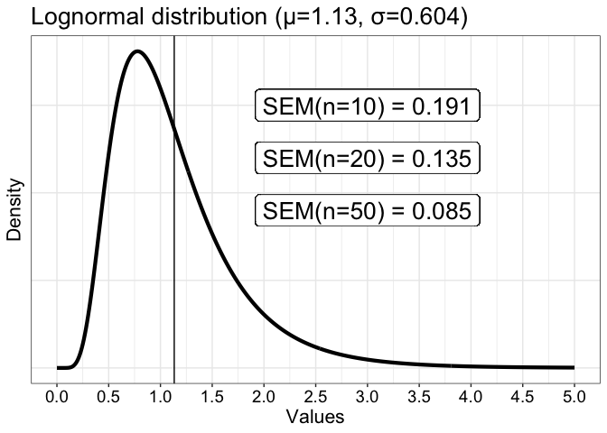
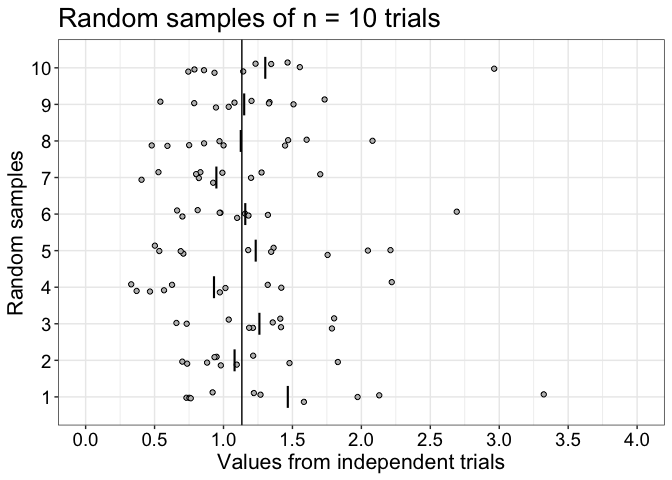
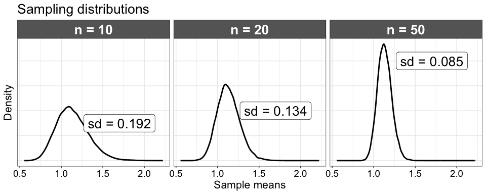

Sampling distributions from a lognormal population distribution
================
Guillaume A. Rousselet
2025-09-09

- [Dependencies](#dependencies)
- [Population](#population)
- [Random samples](#random-samples)
- [Sampling distributions](#sampling-distributions)
  - [Simulation](#simulation)
  - [Standard error of the mean (SEM)](#standard-error-of-the-mean-sem)
  - [Illustrate results](#illustrate-results)
- [Summary figure](#summary-figure)

# Dependencies

``` r
library(ggplot2)
source("./functions/theme_gar.txt") # define ggplot theme
library(tibble)
library(cowplot)
# library(Cairo) -- only needed to knit in pdf
```

About the Cairo package, see this [**blog
post**](https://www.andrewheiss.com/blog/2017/09/27/working-with-r-cairo-graphics-custom-fonts-and-ggplot/).

``` r
sessionInfo()
```

    ## R version 4.2.2 (2022-10-31)
    ## Platform: x86_64-apple-darwin17.0 (64-bit)
    ## Running under: macOS Big Sur ... 10.16
    ## 
    ## Matrix products: default
    ## BLAS:   /Library/Frameworks/R.framework/Versions/4.2/Resources/lib/libRblas.0.dylib
    ## LAPACK: /Library/Frameworks/R.framework/Versions/4.2/Resources/lib/libRlapack.dylib
    ## 
    ## locale:
    ## [1] en_US.UTF-8/en_US.UTF-8/en_US.UTF-8/C/en_US.UTF-8/en_US.UTF-8
    ## 
    ## attached base packages:
    ## [1] stats     graphics  grDevices utils     datasets  methods   base     
    ## 
    ## other attached packages:
    ## [1] cowplot_1.1.1 tibble_3.2.1  ggplot2_3.5.1
    ## 
    ## loaded via a namespace (and not attached):
    ##  [1] rstudioapi_0.14   knitr_1.50        magrittr_2.0.3    tidyselect_1.2.1 
    ##  [5] munsell_0.5.1     colorspace_2.1-1  R6_2.6.1          rlang_1.1.5      
    ##  [9] fastmap_1.2.0     dplyr_1.1.4       tools_4.2.2       grid_4.2.2       
    ## [13] gtable_0.3.6      xfun_0.51         cli_3.6.4         withr_3.0.2      
    ## [17] htmltools_0.5.8.1 yaml_2.3.10       digest_0.6.37     lifecycle_1.0.4  
    ## [21] vctrs_0.6.5       glue_1.8.0        evaluate_1.0.3    rmarkdown_2.29   
    ## [25] compiler_4.2.2    pillar_1.10.1     generics_0.1.3    scales_1.3.0     
    ## [29] pkgconfig_2.0.3

# Population

We define a lognormal population. See this [**blog
post**](https://msalganik.wordpress.com/2017/01/21/making-sense-of-the-rlnorm-function-in-r/)
on how to use the `lnorm` functions in R.

``` r
x <- seq(0, 5, 0.01)
meanlog <- 0
sdlog <- 0.5
pop.dens <- dlnorm(x, meanlog = meanlog, sdlog = sdlog) # population density function
pop.m <- exp(meanlog + sdlog^2 / 2) # population mean
pop.sd <- sqrt( (exp(sdlog^2)-1)*exp(2*meanlog + sdlog^2) ) # population sd

# exp(meanlog) # population median
# exp(meanlog - sdlog^2) # population mode

# test using finite population
# pop <- rlnorm(1000000, meanlog, sdlog)
# mean(pop)
# sd(pop)

# SEM
# round(pop.sd / sqrt(10), digits = 3)
# round(pop.sd / sqrt(20), digits = 3)
# round(pop.sd / sqrt(50), digits = 3)

df <- tibble(x = x, y = pop.dens)
p <- ggplot(df, aes(x=x, y=y)) + theme_gar +
 geom_line(size = 1.5) +
  geom_vline(xintercept = pop.m) +
  scale_x_continuous(breaks = seq(0, 5, .5)) +
  labs(x = "Values", y = "Density") +
  theme(axis.text.y = element_blank(),
        axis.ticks.y = element_blank(),
        panel.grid.minor.y = element_blank()) +
  # SEM labels
  geom_label(aes(x = 3, y = 0.75, 
             label = "SEM(n=10) = 0.191"), 
             size = 7
            ) + 
  geom_label(aes(x = 3, y = 0.60, 
             label = "SEM(n=20) = 0.135"), 
             size = 7
            ) + 
  geom_label(aes(x = 3, y = 0.45, 
             label = "SEM(n=50) = 0.085"), 
             size = 7
            ) + 
  ggtitle(paste0("Lognormal distribution (\U03BC=",round(pop.m,digits = 2),", \U03C3=",round(pop.sd, digits = 3),")"))
p
```

<!-- -->

``` r
pA <- p
```

For a sample of n=10 observations, the standard error of the mean (SEM)
is $\frac{sd}{\sqrt{n}}$ = 0.191.

# Random samples

We draw random samples of size n=10 from the population. Because of
random sampling, the sample means can be close or far from the
population mean.

``` r
set.seed(1) # reproducible result
nsamp <- 10 # number of samples
nt <- 10 # sample size: number of trials
samp <- matrix(rlnorm(nsamp * nt, meanlog, sdlog), nrow = nsamp)

df <- tibble(val = as.vector(samp),
             Samples = rep(1:nsamp, nt))

df2 <- tibble(val = apply(samp, 1, mean),
              Samples = 1:nsamp)

# illustrate sample
p <- ggplot(df, aes(x = val, y = Samples)) + theme_gar +
  geom_jitter(height = .15, alpha = 1,
              shape = 21, fill = "grey", colour = "black") +
  geom_segment(data = df2, 
               aes(x=val, xend=val, y=Samples-0.3, yend=Samples+0.3),
               size = 0.75) +
  geom_vline(xintercept = pop.m) +
  theme(panel.grid.minor.y = element_blank()) +
  coord_cartesian(xlim = c(0, 4)) +
  scale_x_continuous(breaks = seq(0, 5, .5)) +
  scale_y_continuous(breaks = seq(1, 10, 1)) +
  labs(x = "Values from independent trials",
       y = "Random samples") +
    ggtitle("Random samples of n = 10 trials")
p
```

<!-- -->

``` r
pB <- p
```

# Sampling distributions

The variability demonstrated in the previous section depends on sample
size: with larger samples, the sample means tend to be closer to the
population mean on average. Here we illustrate distributions of sample
means, for 20000 simulations / experiments, in which we draw samples of
different sizes. These distributions are called **sampling
distributions**.

## Simulation

``` r
set.seed(21)
nsim <- 20000 # number of iterations
n <- 10
sampd10 <- apply(matrix(rlnorm(n*nsim, meanlog, sdlog), nrow = nsim), 1, mean)
n <- 20
sampd20 <- apply(matrix(rlnorm(n*nsim, meanlog, sdlog), nrow = nsim), 1, mean)
n <- 50
sampd50 <- apply(matrix(rlnorm(n*nsim, meanlog, sdlog), nrow = nsim), 1, mean)
```

## Standard error of the mean (SEM)

SEM is defined as the standard deviation of the sampling distribution of
the sample mean.

``` r
sd(sampd10) 
```

    ## [1] 0.1916616

``` r
sd(sampd20) 
```

    ## [1] 0.1344671

``` r
sd(sampd50) 
```

    ## [1] 0.08541291

These values, should be very similar to the values obtained using the
population standard deviation—this is the case:

``` r
pop.sd / sqrt(10)
```

    ## [1] 0.1909701

``` r
pop.sd / sqrt(20)
```

    ## [1] 0.1350363

``` r
pop.sd / sqrt(50)
```

    ## [1] 0.08540443

The two sets of values will converge with an increasingly large number
of simulations.

## Illustrate results

``` r
# distributions
df <- tibble(obs = c(sampd10, sampd20, sampd50),
             cond = factor(c(rep(10, nsim),
                             rep(20, nsim),
                             rep(50, nsim)))
             )

# add labels with sd of each sampling distribution
df.lab <- tibble(label = c(paste0("sd = ",round(sd(sampd10),digits = 3)), 
                           paste0("sd = ",round(sd(sampd20), digits = 3)), 
                           paste0("sd = ",round(sd(sampd50), digits = 3))),
                 cond = factor(c(10, 20, 50)),
                 x = c(1.7, 1.7, 1.7),
                 y = c(1.5, 2, 4))

# change facet labels
labels <- c("10" = "n = 10", "20" = "n = 20", "50" = "n = 50")

p <- ggplot(df, aes(x=obs)) + theme_gar +
  geom_line(stat = "density", size = 1) +
  theme(axis.text.y = element_blank(),
        axis.ticks.y = element_blank(),
        panel.grid.minor.y = element_blank()) +
  facet_grid(cols = vars(cond), labeller=labeller(cond = labels)) +
  labs(x = "Sample means", y = "Density") + 
  geom_label(data = df.lab, 
             aes(x = x, y = y, label = label),
             size = 7) +
  ggtitle("Sampling distributions")
p
```

<!-- -->

``` r
pC <- p
```

# Summary figure

``` r
# combine panels into one figure
pAB <- cowplot::plot_grid(pA, pB,
                          labels = c("A", "B"),
                          ncol = 2,
                          nrow = 1,
                          rel_widths = c(1, 1), 
                          label_size = 20, 
                          # hjust = -0.5, 
                          scale = 1,
                          align = 'h')

p.all <- cowplot::plot_grid(pAB, pC,
                            labels = c("", "C"),
                            ncol = 1,
                            nrow = 2,
                            rel_heights = c(1, 1), 
                            label_size = 20, 
                            # hjust = -0.5, 
                            scale = 1)
# save figure
ggsave(p.all, filename=('./figures/fig_lognormal.tiff'),
       width=15, height=10, dpi = 300)
# device = tiff, type = "cairo"
# dev.off()
```
