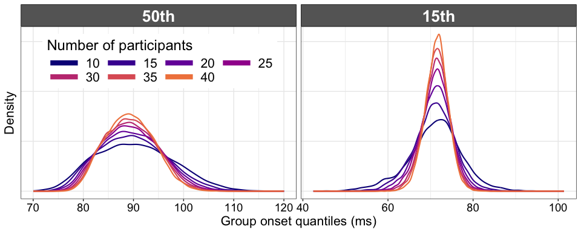
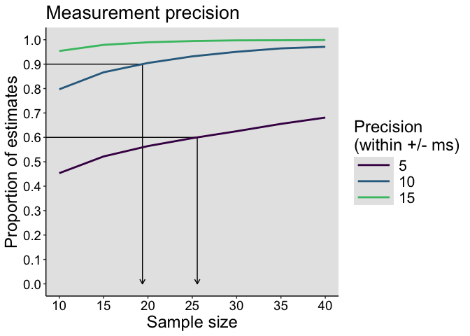
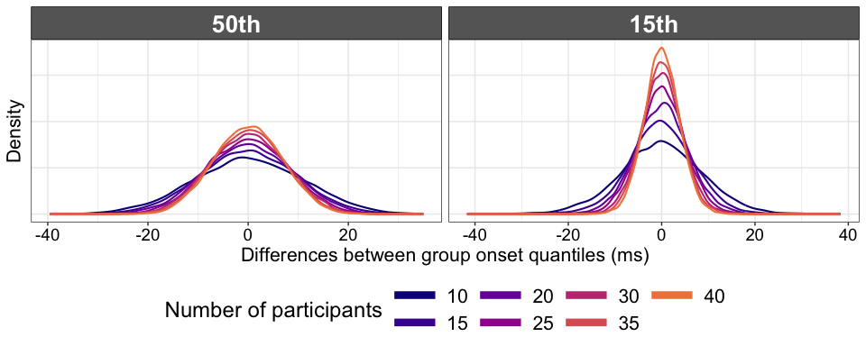
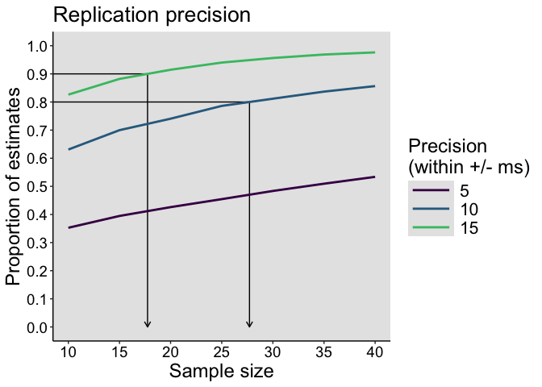
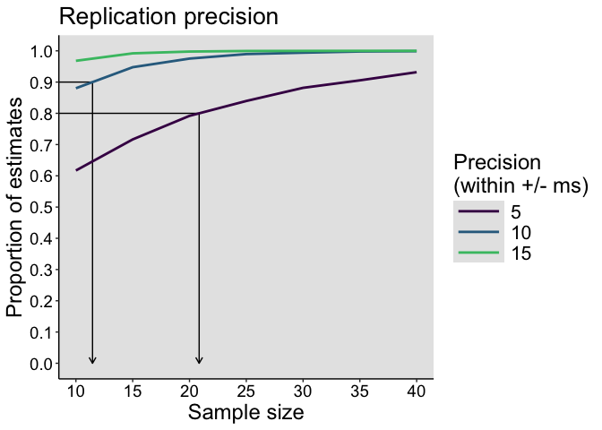

Sampling distributions for onset data
================
Guillaume A. Rousselet
2025-09-09

- [Dependencies](#dependencies)
- [Illustrate sample](#illustrate-sample)
- [Sampling distributions](#sampling-distributions)
  - [Illustrate results](#illustrate-results)
- [Illustrate precision](#illustrate-precision)
  - [50th quantile](#50th-quantile)
  - [15th quantile](#15th-quantile)
- [Probability to replicate an
  effect](#probability-to-replicate-an-effect)
  - [Differences](#differences)
  - [Probabilities](#probabilities)
  - [15th quantile](#15th-quantile-1)
- [Summary figure](#summary-figure)

# Dependencies

``` r
library(ggplot2)
source("./functions/theme_gar.txt") # define ggplot theme
source("./functions/trimpval.txt") # get one-sample t-test on trimmed means
source("./functions/functions.txt")
library(tibble)
# library(cowplot)
# install.packages("devtools")
# devtools::install_github("GRousselet/rogme")
library(rogme)
library(beepr)
# devtools::install_github("zeehio/facetscales") 
# library(facetscales) # set different scales for each facet
```

``` r
sessionInfo()
```

    ## R version 4.2.2 (2022-10-31)
    ## Platform: x86_64-apple-darwin17.0 (64-bit)
    ## Running under: macOS Big Sur ... 10.16
    ## 
    ## Matrix products: default
    ## BLAS:   /Library/Frameworks/R.framework/Versions/4.2/Resources/lib/libRblas.0.dylib
    ## LAPACK: /Library/Frameworks/R.framework/Versions/4.2/Resources/lib/libRlapack.dylib
    ## 
    ## locale:
    ## [1] en_US.UTF-8/en_US.UTF-8/en_US.UTF-8/C/en_US.UTF-8/en_US.UTF-8
    ## 
    ## attached base packages:
    ## [1] stats     graphics  grDevices utils     datasets  methods   base     
    ## 
    ## other attached packages:
    ## [1] beepr_1.3     rogme_0.2.1   tibble_3.2.1  ggplot2_3.5.1
    ## 
    ## loaded via a namespace (and not attached):
    ##  [1] rstudioapi_0.14   knitr_1.50        magrittr_2.0.3    tidyselect_1.2.1 
    ##  [5] munsell_0.5.1     colorspace_2.1-1  R6_2.6.1          rlang_1.1.5      
    ##  [9] fastmap_1.2.0     stringr_1.5.1     dplyr_1.1.4       tools_4.2.2      
    ## [13] grid_4.2.2        gtable_0.3.6      xfun_0.51         audio_0.1-10     
    ## [17] cli_3.6.4         withr_3.0.2       htmltools_0.5.8.1 yaml_2.3.10      
    ## [21] digest_0.6.37     lifecycle_1.0.4   vctrs_0.6.5       glue_1.8.0       
    ## [25] evaluate_1.0.3    rmarkdown_2.29    stringi_1.8.3     compiler_4.2.2   
    ## [29] pillar_1.10.1     generics_0.1.3    scales_1.3.0      pkgconfig_2.0.3

Here we look at ERP onsets from an object detection task ([Bieniek et
al. 2016](https://onlinelibrary.wiley.com/doi/full/10.1111/ejn.13100)).
In that study, 74 of our 120 participants were tested twice, to assess
the test-retest reliability of different measurements, including onsets.
The distributions of onsets across participants is positively skewed,
with a few participants with particularly early or late onsets. The
distributions for the two sessions appear quite similar.

We merge data from two sessions, treating them as independent, to
provide a larger dataset to run simulations. For the simulations, we
treat the full sample of onsets as a population we’re trying to esimate.

``` r
onsets <- as.vector(rogme::onsets2)
onsets <- onsets[!is.na(onsets)]
# define population parameters
pop.n <- length(onsets)
pop.hd50 <- hd(onsets, q = 0.5)
pop.hd15 <- hd(onsets, q = 0.15)  
```

# Illustrate sample

``` r
set.seed(11) # for reproducible jitter
# raw data
df <- tibble(val = onsets, y = rep(1, pop.n))

df.q1 <- tibble(x = q1(onsets), xend = x, 
                y = rep(0.9,2), yend = rep(1.1,2))

df.q2 <- tibble(x = q2(onsets), xend = x, 
                y = rep(0.9,2), yend = rep(1.1,2))

df.q3 <- tibble(x = q3(onsets), xend = x, 
                y = rep(0.9,2), yend = rep(1.1,2))

p <- ggplot(data = df, aes(x = val, y = y)) + theme_gar +
  # scatterplots
    geom_jitter(height = .05, alpha = 0.5, 
                size = 3, shape = 21, fill = "grey", colour = "black") +
  theme(axis.ticks.y = element_blank(),
        axis.text.y = element_blank(),
        axis.title.y = element_blank()) +
  # panel.grid.minor.x = element_blank()
  scale_y_continuous(breaks = 1) +
  scale_x_continuous(lim = c(0, 300), breaks = seq(0,300,50)) +
  # quartiles
    geom_segment(data = df.q1, aes(y = y, yend = yend,
                   x = x, xend = xend),
                   size = 1, lineend = 'round') +
    geom_segment(data = df.q2, aes(y = y, yend = yend,
                   x = x, xend = xend),
                   size = 2, lineend = 'round') +
    geom_segment(data = df.q3, aes(y = y, yend = yend,
                   x = x, xend = xend),
                   size = 1, lineend = 'round') +
  labs(x = "ERP onsets (ms)")
```

    ## Warning: Using `size` aesthetic for lines was deprecated in ggplot2 3.4.0.
    ## ℹ Please use `linewidth` instead.
    ## This warning is displayed once every 8 hours.
    ## Call `lifecycle::last_lifecycle_warnings()` to see where this warning was
    ## generated.

``` r
p
```

<!-- -->

``` r
pA <- p
```

# Sampling distributions

``` r
set.seed(21)
nsim <- 10000
nseq <- seq(10,40,5)
maxn <- max(nseq)
# quantiles
simres.hd50 <- matrix(NA, nrow = nsim, ncol = length(nseq))
simres.hd15 <- matrix(NA, nrow = nsim, ncol = length(nseq))

# precision
preseq <- seq(5, 15, 5) # precision bounds
Npre <- length(preseq)
simres.pre.hd50 <- matrix(NA, nrow = Npre, ncol = length(nseq))
simres.pre.hd15 <- matrix(NA, nrow = Npre, ncol = length(nseq))

# replication difference
simres.rep.hd50 <- matrix(NA, nrow = nsim, ncol = length(nseq))
simres.rep.hd15 <- matrix(NA, nrow = nsim, ncol = length(nseq))

# replication precision
simres.rep.pre.hd50 <- matrix(NA, nrow = Npre, ncol = length(nseq))
simres.rep.pre.hd15 <- matrix(NA, nrow = Npre, ncol = length(nseq))

# get all samples at once
simsamp <- matrix(sample(onsets, maxn * nsim, replace = TRUE), nrow = nsim)
simsamp2 <- matrix(sample(onsets, maxn * nsim, replace = TRUE), nrow = nsim)

for(N in 1:length(nseq)){ # for each sample size
  simres.hd50[, N] <- apply(simsamp[, 1:nseq[N]], 1, q2)
  simres.hd15[, N] <- apply(simsamp[, 1:nseq[N]], 1, hd, q = 0.15)
  
  # REPLICATION DIFFERENCE
  simres.rep.hd50[, N] <- simres.hd50[, N] - apply(simsamp2[, 1:nseq[N]], 1, q2)
  simres.rep.hd15[, N] <- simres.hd15[, N] - apply(simsamp2[, 1:nseq[N]], 1, hd, q = 0.15)
  
  # PRECISION
  for(iter.p in 1:Npre){
    # Probability of getting estimate within +/- x ms of population value
    simres.pre.hd50[iter.p, N] <- mean((simres.hd50[, N]-pop.hd50) <= preseq[iter.p] & (simres.hd50[, N]-pop.hd50) >= (-1*preseq[iter.p]))
    simres.pre.hd15[iter.p, N] <- mean((simres.hd15[, N]-pop.hd15) <= preseq[iter.p] & (simres.hd15[, N]-pop.hd15) >= (-1*preseq[iter.p]))
    # Probability of getting estimates from 2 experiments at most x ms of each other  
    simres.rep.pre.hd50[iter.p, N] <- mean( abs(simres.rep.hd50[, N]) <= preseq[iter.p] )
    simres.rep.pre.hd15[iter.p, N] <- mean( abs(simres.rep.hd15[, N]) <= preseq[iter.p] )
  }
  
}

save(nsim, nseq, simres.hd50, simres.hd15,
  preseq, Npre, simres.pre.hd50, simres.pre.hd15,
  simres.rep.pre.hd50, simres.rep.pre.hd15,
  simres.rep.hd50, simres.rep.hd15,
  file = "./data/onsets_sim.RData")
```

## Illustrate results

``` r
load(file = "./data/onsets_sim.RData")

df <- tibble(x = c(as.vector(simres.hd50),as.vector(simres.hd15)),
             np = factor(rep(rep(nseq, each = nsim),2)),
             q = factor(rep(c("50th","15th"), each = nsim * length(nseq)))
             )

df$q <- keeporder(df$q)

p <- ggplot(df, aes(x = x, colour = np)) + theme_gar +
  # geom_vline(xintercept = pop.tm.diff) +
  geom_line(stat = "density", size = 0.75) +
  theme(legend.position = "bottom",
        axis.text.y = element_blank(),
        axis.ticks.y = element_blank(),
        panel.grid.minor.y = element_blank(),
        legend.position.inside = c(0.25,0.8)) +
  guides(colour = guide_legend(nrow=2, byrow=TRUE,
                               override.aes = list(linewidth = 3),
                               title = "Number of participants",
                               position = "inside")) +
  scale_colour_viridis_d(option = "plasma", 
                         begin = 0, end = 0.7) + 
  facet_grid(cols = vars(q), scales = "free") +
  labs(x = "Group onset quantiles (ms)", y = "Density")
pB <- p
p
```

<!-- -->

What is the proportion of onsets estimates that are within +/- a certain
value from the population onset quantile?

With a sample size of 10 participants, about 79.7% of 50th quantile
estimates are within +/- 10 ms of the population value.

With a sample size of 35 participants, about 97.1% of 50th quantile
estimates are within +/- 10 ms of the population value.

We can also ask which sample size is needed to achieve a certain level
of precision.

For instance:

For 60% of 50th quantile estimates to be within +/- 5 ms of the
population value, we need at least 26 observations.

For 90% of 50th quantile estimates to be within +/- 10 ms of the
population value, we need at least 19 observations.

These values are illustrated in the next figure using black lines and
arrows. The figure shows the proportion of estimates near the true
value, for different sample sizes, and for different levels of
precision. The bottom-line is that even if we’re willing to make
imprecise measurements, we need a lot of observations to be precise
enough and often enough in the long run.

# Illustrate precision

## 50th quantile

``` r
df <- tibble(`Proportion` = as.vector(simres.pre.hd50),
             `Precision` = factor(rep(preseq, length(nseq))),
             `Size` = rep(nseq, each = Npre))

df$Precision <- keeporder(df$Precision)

# data frame to plot segments
tmp.pos <- approx(y=nseq,x=simres.pre.hd50[1,],xout=0.60)$y
df.seg1 <- tibble(x=0, xend=tmp.pos,
                  y=0.6, yend=0.6)
df.seg2 <- tibble(x=tmp.pos, xend=tmp.pos,
                  y=0.6, yend=0)
tmp.pos <- approx(y=nseq,x=simres.pre.hd50[2,],xout=0.90)$y
df.seg3 <- tibble(x=0, xend=tmp.pos,
                  y=0.9, yend=0.9)
df.seg4 <- tibble(x=tmp.pos, xend=tmp.pos,
                  y=0.9, yend=0)
# make plot
p <- ggplot(df, aes(x=Size, y=Proportion)) + theme_classic() +
  # geom_abline(intercept=0.7, slope=0, colour="grey20") +
  geom_segment(data = df.seg1, aes(x=x, y=y, xend=xend, yend=yend)) +
  geom_segment(data = df.seg2, aes(x=x, y=y, xend=xend, yend=yend), 
               arrow = arrow(length = unit(0.2, "cm"))) +
  geom_segment(data = df.seg3, aes(x=x, y=y, xend=xend, yend=yend)) +
  geom_segment(data = df.seg4, aes(x=x, y=y, xend=xend, yend=yend), 
               arrow = arrow(length = unit(0.2, "cm"))) +
  geom_line(aes(colour = Precision), size = 1) + 
  scale_colour_viridis_d(end = 0.7) +
  scale_x_continuous(breaks=nseq) + 
  scale_y_continuous(breaks=seq(0, 1, 0.1)) +
  coord_cartesian(xlim = c(10, 40), ylim=c(0, 1)) +
  theme(plot.title = element_text(size=20),
        axis.title.x = element_text(size = 18),
        axis.text = element_text(size = 14, colour="black"),
        axis.title.y = element_text(size = 18),
        legend.key.width = unit(1.5,"cm"),
        legend.position = "right",
        legend.text=element_text(size = 16),
        legend.title=element_text(size = 18),
        panel.background = element_rect(fill="grey90")) +
  labs(x = "Sample size", y = "Proportion of estimates") +
  guides(colour = guide_legend(override.aes = list(size=3), # make thicker legend lines
    title = "Precision \n(within +/- ms)")) + # change legend title
  ggtitle("Measurement precision") 
p
```

<!-- -->

## 15th quantile

For 80% of 50th quantile estimates to be within +/- 5 ms of the full
sample value, we need at least 21 observations.

For 90% of 50th quantile estimates to be within +/- 10 ms of the full
sample value, we need at least 11 observations.

``` r
df <- tibble(`Proportion` = as.vector(simres.pre.hd15),
             `Precision` = factor(rep(preseq, length(nseq))),
             `Size` = rep(nseq, each = Npre))

df$Precision <- keeporder(df$Precision)

# data frame to plot segments
tmp.pos <- approx(y=nseq,x=simres.pre.hd15[1,],xout=0.80)$y
df.seg1 <- tibble(x=0, xend=tmp.pos,
                  y=0.8, yend=0.8)
df.seg2 <- tibble(x=tmp.pos, xend=tmp.pos,
                  y=0.8, yend=0)
tmp.pos <- approx(y=nseq,x=simres.pre.hd15[2,],xout=0.90)$y
df.seg3 <- tibble(x=0, xend=tmp.pos,
                  y=0.9, yend=0.9)
df.seg4 <- tibble(x=tmp.pos, xend=tmp.pos,
                  y=0.9, yend=0)
# make plot
p <- ggplot(df, aes(x=Size, y=Proportion)) + theme_classic() +
  # geom_abline(intercept=0.7, slope=0, colour="grey20") +
  geom_segment(data = df.seg1, aes(x=x, y=y, xend=xend, yend=yend)) +
  geom_segment(data = df.seg2, aes(x=x, y=y, xend=xend, yend=yend),
               arrow = arrow(length = unit(0.2, "cm"))) +
  geom_segment(data = df.seg3, aes(x=x, y=y, xend=xend, yend=yend)) +
  geom_segment(data = df.seg4, aes(x=x, y=y, xend=xend, yend=yend),
               arrow = arrow(length = unit(0.2, "cm"))) +
  geom_line(aes(colour = Precision), size = 1) + 
  scale_colour_viridis_d(end = 0.7) +
  scale_x_continuous(breaks=nseq) + 
  scale_y_continuous(breaks=seq(0, 1, 0.1)) +
  coord_cartesian(xlim = c(10, 40), ylim=c(0, 1)) +
  theme(plot.title = element_text(size=20),
        axis.title.x = element_text(size = 18),
        axis.text = element_text(size = 14, colour="black"),
        axis.title.y = element_text(size = 18),
        legend.key.width = unit(1.5,"cm"),
        legend.position = "right",
        legend.text=element_text(size = 16),
        legend.title=element_text(size = 18),
        panel.background = element_rect(fill="grey90")) +
  labs(x = "Sample size", y = "Proportion of estimates") +
  guides(colour = guide_legend(override.aes = list(size=3), # make thicker legend lines
    title = "Precision \n(within +/- ms)")) + # change legend title
  ggtitle("Measurement precision") 
p
```

<!-- -->

# Probability to replicate an effect

For a given precision, what is the probability to observe similar
effects in two consecutive experiments? In other words, what is the
probability that two measurements differ by at most a certain amount?

The estimation uncertainty associated with small sample sizes leads to
another problem: effects are not likely to replicate. A successful
replication can be defined in several ways. Here I won’t consider the
relatively trivial case of finding a statistically significant
($p\leq0.05$) effect going in the same direction in two experiments.
Instead, let’s consider how close two estimates are. We can determine,
given a certain level of precision, the probability to observe similar
effects in two consecutive experiments. In other words, we can find the
probability that two measurements differ by at most a certain amount.
Not surprisingly, the results follow the same pattern as those observed
in the previous figure: the probability to replicate (y-axis) increases
with sample size (x-axis) and with the uncertainty we’re willing to
accept (see legend with colour coded difference conditions).

## Differences

``` r
df <- tibble(x = c(as.vector(simres.rep.hd50),as.vector(simres.rep.hd15)),
             np = factor(rep(rep(nseq, each = nsim),2)),
             q = factor(rep(c("50th","15th"), each = nsim * length(nseq)))
             )

df$q <- keeporder(df$q)

p <- ggplot(df, aes(x = x, colour = np)) + theme_gar +
  # geom_vline(xintercept = pop.tm.diff) +
  geom_line(stat = "density", size = 0.75) +
  theme(legend.position = "bottom",
        axis.text.y = element_blank(),
        axis.ticks.y = element_blank(),
        panel.grid.minor.y = element_blank()) +
  guides(colour = guide_legend(override.aes = list(linewidth = 3),
                               title = "Number of participants")) +
  scale_colour_viridis_d(option = "plasma", 
                         begin = 0, end = 0.7) + 
  facet_grid(cols = vars(q), scales = "free") +
  labs(x = "Differences between group onset quantiles (ms)", y = "Density")
pC <- p
p
```

<!-- -->

What is the proportion of replications that are within +/- a certain
value from each other?

With a sample size of 10 participants, about 63.1% of 50th quantile
estimates are within +/- 10 ms of each other.

With a sample size of 35 participants, about 85.7% of 50th quantile
estimates are within +/- 10 ms of each other.

## Probabilities

### 50th quantile

For 80% of replications to be at most 10 ms apart, we need at least 28
observations.

For 90% of replications to be at most 15 ms apart, we need at least 18
observations.

``` r
df <- tibble(`Proportion` = as.vector(simres.rep.pre.hd50),
             `Precision` = factor(rep(preseq, length(nseq))),
             `Size` = rep(nseq, each = Npre))

df$Precision <- keeporder(df$Precision)

# data frame to plot segments
tmp.pos <- approx(y=nseq,x=simres.rep.pre.hd50[2,],xout=0.80)$y
df.seg1 <- tibble(x=0, xend=tmp.pos,
                  y=0.8, yend=0.8)
df.seg2 <- tibble(x=tmp.pos, xend=tmp.pos,
                  y=0.8, yend=0)
tmp.pos <- approx(y=nseq,x=simres.rep.pre.hd50[3,],xout=0.90)$y
df.seg3 <- tibble(x=0, xend=tmp.pos,
                  y=0.9, yend=0.9)
df.seg4 <- tibble(x=tmp.pos, xend=tmp.pos,
                  y=0.9, yend=0)
# make plot
p <- ggplot(df, aes(x=Size, y=Proportion)) + theme_classic() +
  # geom_abline(intercept=0.7, slope=0, colour="grey20") +
  geom_segment(data = df.seg1, aes(x=x, y=y, xend=xend, yend=yend)) +
  geom_segment(data = df.seg2, aes(x=x, y=y, xend=xend, yend=yend), 
               arrow = arrow(length = unit(0.2, "cm"))) +
  geom_segment(data = df.seg3, aes(x=x, y=y, xend=xend, yend=yend)) +
  geom_segment(data = df.seg4, aes(x=x, y=y, xend=xend, yend=yend), 
               arrow = arrow(length = unit(0.2, "cm"))) +
  geom_line(aes(colour = Precision), size = 1) + 
  scale_colour_viridis_d(end = 0.7) +
  scale_x_continuous(breaks=nseq) + 
  scale_y_continuous(breaks=seq(0, 1, 0.1)) +
  coord_cartesian(xlim = c(10, 40), ylim=c(0, 1)) +
  theme(plot.title = element_text(size=20),
        axis.title.x = element_text(size = 18),
        axis.text = element_text(size = 14, colour="black"),
        axis.title.y = element_text(size = 18),
        legend.key.width = unit(1.5,"cm"),
        legend.position = "right",
        legend.text=element_text(size = 16),
        legend.title=element_text(size = 18),
        panel.background = element_rect(fill="grey90")) +
  labs(x = "Sample size", y = "Proportion of estimates") +
  guides(colour = guide_legend(override.aes = list(size=3), # make thicker legend lines
    title = "Precision \n(within +/- ms)")) + # change legend title
  ggtitle("Replication precision") 
p
```

<!-- -->

## 15th quantile

``` r
df <- tibble(`Proportion` = as.vector(simres.pre.hd15),
             `Precision` = factor(rep(preseq, length(nseq))),
             `Size` = rep(nseq, each = Npre))

df$Precision <- keeporder(df$Precision)

# data frame to plot segments
tmp.pos <- approx(y=nseq,x=simres.pre.hd15[1,],xout=0.80)$y
df.seg1 <- tibble(x=0, xend=tmp.pos,
                  y=0.8, yend=0.8)
df.seg2 <- tibble(x=tmp.pos, xend=tmp.pos,
                  y=0.8, yend=0)
tmp.pos <- approx(y=nseq,x=simres.pre.hd15[2,],xout=0.90)$y
df.seg3 <- tibble(x=0, xend=tmp.pos,
                  y=0.9, yend=0.9)
df.seg4 <- tibble(x=tmp.pos, xend=tmp.pos,
                  y=0.9, yend=0)
# make plot
p <- ggplot(df, aes(x=Size, y=Proportion)) + theme_classic() +
  # geom_abline(intercept=0.7, slope=0, colour="grey20") +
  geom_segment(data = df.seg1, aes(x=x, y=y, xend=xend, yend=yend)) +
  geom_segment(data = df.seg2, aes(x=x, y=y, xend=xend, yend=yend),
               arrow = arrow(length = unit(0.2, "cm"))) +
  geom_segment(data = df.seg3, aes(x=x, y=y, xend=xend, yend=yend)) +
  geom_segment(data = df.seg4, aes(x=x, y=y, xend=xend, yend=yend),
               arrow = arrow(length = unit(0.2, "cm"))) +
  geom_line(aes(colour = Precision), size = 1) + 
  scale_colour_viridis_d(end = 0.7) +
  scale_x_continuous(breaks=nseq) + 
  scale_y_continuous(breaks=seq(0, 1, 0.1)) +
  coord_cartesian(xlim = c(10, 40), ylim=c(0, 1)) +
  theme(plot.title = element_text(size=20),
        axis.title.x = element_text(size = 18),
        axis.text = element_text(size = 14, colour="black"),
        axis.title.y = element_text(size = 18),
        legend.key.width = unit(1.5,"cm"),
        legend.position = "right",
        legend.text=element_text(size = 16),
        legend.title=element_text(size = 18),
        panel.background = element_rect(fill="grey90")) +
  labs(x = "Sample size", y = "Proportion of estimates") +
  guides(colour = guide_legend(override.aes = list(size=3), # make thicker legend lines
    title = "Precision \n(within +/- ms)")) + # change legend title
  ggtitle("Replication precision") 
p
```

<!-- -->

# Summary figure

``` r
# get_legend doesn't work here
# legend.toplot <- cowplot::get_plot_component(pC, legend)

cowplot::plot_grid(pA, 
                   pB, 
                   pC + theme(legend.position = "none"), 
                   # legend.toplot,
                    # labels = c("A", "B", "C", NA),
                   labels = c("A", "B", "C"),
                    ncol = 1,
                    nrow = 3,
                    rel_heights = c(1/2, 1, 1),
                    label_size = 20,
                    align = 'v',
                    axis = 'l',
                    hjust = -0.5,
                    scale = 1)

# save figure
ggsave(filename=('./figures/fig_onsets.tiff'),width=10, height=10, dpi=300)
```
