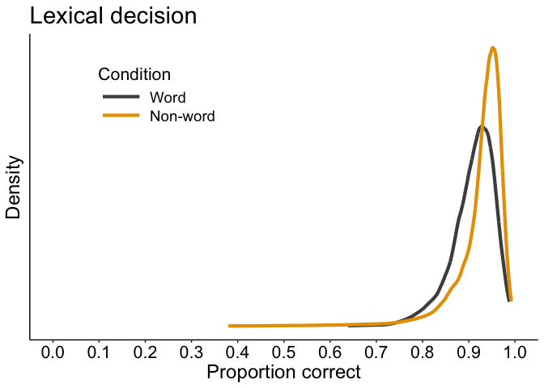
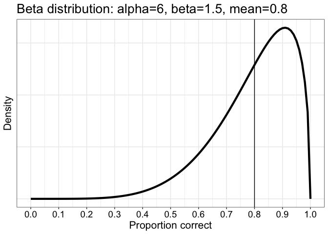

Sampling distributions for percent correct data
================
Guillaume A. Rousselet
2025-09-09

- [Dependencies](#dependencies)
- [Relationship between mean percent correct and
  variability](#relationship-between-mean-percent-correct-and-variability)
  - [Theoretical distributions](#theoretical-distributions)
- [Example of percent correct data from lexical decision
  dataset](#example-of-percent-correct-data-from-lexical-decision-dataset)
  - [Illustrate data](#illustrate-data)
  - [Fit beta distributions](#fit-beta-distributions)
- [Mean percentage correct = 0.7](#mean-percentage-correct--07)
  - [Define beta distribution for target
    PC](#define-beta-distribution-for-target-pc)
  - [Examples of random samples](#examples-of-random-samples)
  - [Generate group data: simple example
    1](#generate-group-data-simple-example-1)
  - [Generate group data: simple example
    2](#generate-group-data-simple-example-2)
  - [Generate group data: simple example
    3](#generate-group-data-simple-example-3)
  - [Generate group data: full
    example](#generate-group-data-full-example)
- [Summary figure](#summary-figure)
- [For fun: illustrate beta distributions for 80% correct
  responses](#for-fun-illustrate-beta-distributions-for-80-correct-responses)
  - [Define illustration function](#define-illustration-function)
  - [Example 1](#example-1)
  - [Example 2](#example-2)
  - [Example 3](#example-3)
  - [Example 4](#example-4)
  - [Example 5](#example-5)
  - [5 examples in one figure](#5-examples-in-one-figure)

# Dependencies

``` r
library(ggplot2)
source("./functions/theme_gar.txt") # define ggplot theme
library(tibble)
# library(cowplot)
source("./functions/akerd.txt")
# install.packages("devtools")
# devtools::install_github("GRousselet/rogme")
library(rogme) # to get datasets
library(beepr)
library(Rfast) # to fit beta distribution using MLE
```

``` r
sessionInfo()
```

    ## R version 4.2.2 (2022-10-31)
    ## Platform: x86_64-apple-darwin17.0 (64-bit)
    ## Running under: macOS Big Sur ... 10.16
    ## 
    ## Matrix products: default
    ## BLAS:   /Library/Frameworks/R.framework/Versions/4.2/Resources/lib/libRblas.0.dylib
    ## LAPACK: /Library/Frameworks/R.framework/Versions/4.2/Resources/lib/libRlapack.dylib
    ## 
    ## locale:
    ## [1] en_US.UTF-8/en_US.UTF-8/en_US.UTF-8/C/en_US.UTF-8/en_US.UTF-8
    ## 
    ## attached base packages:
    ## [1] stats     graphics  grDevices utils     datasets  methods   base     
    ## 
    ## other attached packages:
    ## [1] Rfast_2.0.8        RcppZiggurat_0.1.6 Rcpp_1.0.14        beepr_1.3         
    ## [5] rogme_0.2.1        tibble_3.2.1       ggplot2_3.5.1     
    ## 
    ## loaded via a namespace (and not attached):
    ##  [1] pillar_1.10.1     compiler_4.2.2    tools_4.2.2       digest_0.6.37    
    ##  [5] evaluate_1.0.3    lifecycle_1.0.4   gtable_0.3.6      pkgconfig_2.0.3  
    ##  [9] rlang_1.1.5       cli_3.6.4         rstudioapi_0.14   yaml_2.3.10      
    ## [13] parallel_4.2.2    xfun_0.51         fastmap_1.2.0     withr_3.0.2      
    ## [17] dplyr_1.1.4       stringr_1.5.1     knitr_1.50        generics_0.1.3   
    ## [21] vctrs_0.6.5       grid_4.2.2        tidyselect_1.2.1  glue_1.8.0       
    ## [25] R6_2.6.1          rmarkdown_2.29    magrittr_2.0.3    scales_1.3.0     
    ## [29] htmltools_0.5.8.1 colorspace_2.1-1  stringi_1.8.3     munsell_0.5.1    
    ## [33] audio_0.1-10

# Relationship between mean percent correct and variability

The population mean percent correct and standard deviation are
dependent: there is stronger variability at 50% correct and the
variability decreases as the mean tends toward zero or 1.

## Theoretical distributions

Here we illustrate the theoretical relative probabilities of observing
different proportions of correct responses for different true values.
For instance, given that a participant is on average 10% correct, what
is the distribution of the number of correct trials we can expect? For
any given experiment, the number of correct trials ranges from roughly 0
to 20. If the population average is 50%, the values across experiments
range from 45 to 65.

``` r
# df <- tibble(x = seq(0, 100, 0.01))
x <- seq(0, 100, 1)
nt <- 100 # sample size
pc.seq <- seq(.1, .9, .1)
res <- matrix(NA, nrow = length(x), ncol = length(pc.seq))
for(PC in 1:length(pc.seq)){
  res[,PC] <- dbinom(x, size = nt, prob = pc.seq[PC])
}

df <- tibble(pc = rep(x,length(pc.seq)),
             dens = as.vector(res),
             cond = factor(rep(pc.seq*100, each = length(x)))
             )

# scales::show_col(scales::viridis_pal(option="inferno")(9))
# cc <- scales::viridis_pal(option="inferno")(9)

p <- ggplot(df, aes(x = pc, y = dens, colour = cond)) + theme_gar +
  geom_line(size = 1.5) +
  guides(colour = guide_legend(override.aes = list(linewidth = 3),
                               title = "Population\nproportion correct")) +
  scale_colour_viridis_d(option = "cividis") + 
  scale_x_continuous(breaks = seq(0, 100, 10)) +
  labs(x = "Number of correct trials",
       y = "Density") +
  theme(axis.text.y = element_blank(),
        axis.ticks.y = element_blank(),
        panel.grid.minor.y = element_blank()) +
  ggtitle("Binomial PDFs for n = 100 trials")
```

    ## Warning: Using `size` aesthetic for lines was deprecated in ggplot2 3.4.0.
    ## ℹ Please use `linewidth` instead.
    ## This warning is displayed once every 8 hours.
    ## Call `lifecycle::last_lifecycle_warnings()` to see where this warning was
    ## generated.

``` r
pA <- p
p
```

<!-- -->

Distributions are bounded and the variance varies with the mean, so this
type of data should not be modelled using metric scales as in standard
t-test and ANOVA.

# Example of percent correct data from lexical decision dataset

Percent correct data are not normaly distributed. In this example,
participants tend to perform very well, with many averages above 90%.
Some participants are not as good, leading to negative skewness. We
illustrate the data and then fit a beta distribution. Then we move to a
simulated example with an average of 70% correct.

Data from the [French Lexicon
Project](https://sites.google.com/site/frenchlexicon/results). Click on
“French Lexicon Project trial-level results with R scripts.zip”. The
`.RData` dataset was created by applying the script `getflprtdata.Rmd`
available on
[GitHub](https://github.com/GRousselet/rogme/tree/master/data-raw).

``` r
# get data - tibble = `flp`
flp <- rogme::flp
# columns =
#1 = participant
#2 = rt
#3 = acc = accuracy 0/1
#4 = condition = word/non-word

# get accuracy data
flp.acc <- tapply(flp$acc, list(flp$participant, flp$condition), mean)
summary(flp.acc)
```

    ##       word           non-word     
    ##  Min.   :0.6390   Min.   :0.3796  
    ##  1st Qu.:0.8849   1st Qu.:0.9116  
    ##  Median :0.9179   Median :0.9391  
    ##  Mean   :0.9088   Mean   :0.9245  
    ##  3rd Qu.:0.9429   3rd Qu.:0.9580  
    ##  Max.   :0.9880   Max.   :0.9920

## Illustrate data

``` r
# make KDE
flp.w <- sort(flp.acc[,1])
flp.nw <- sort(flp.acc[,2])
a.flp.w <- akerd(flp.w, pyhat = TRUE, plotit = FALSE)
a.flp.nw <- akerd(flp.nw, pyhat = TRUE, plotit = FALSE)

# create data frame
df <- tibble(`x`=c(flp.w,flp.nw),
             `y`=c(a.flp.w,a.flp.nw),
             `Condition`=c(rep.int("Word",length(flp.w)),
                           rep.int("Non-word",length(flp.nw))))
# make plot
df$Condition <- as.character(df$Condition)
df$Condition <- factor(df$Condition, levels=unique(df$Condition))

# make plot
p <- ggplot(df, aes(x,y, group=Condition)) + theme_classic() + 
  geom_line(aes(colour=Condition), size = 1.5) + # linetype=Condition, 
  # scale_size_manual(values=c(1,0.5)) +
  # scale_linetype_manual(values=c("solid","solid")) +
  scale_color_manual(values=c("grey30", "#E69F00")) + #, "#56B4E9","black")) + grey #999999
  scale_x_continuous(limits=c(0,1), breaks=seq(0,1,0.1), minor_breaks = waiver()) +
  theme(plot.title = element_text(size=22),
        axis.title.x = element_text(size = 18),
        axis.text = element_text(size = 16, colour = "black"),
        axis.title.y = element_text(size = 18),
        axis.text.y = element_blank(),
        axis.ticks.y = element_blank(),
        panel.grid.minor.y = element_blank(),
        legend.key.width = unit(1.5,"cm"),
        legend.position = c(0.25,0.8),
        legend.title = element_text(size=16),
        legend.text = element_text(size = 14),
        strip.text.y = element_text(size = 18, face = "bold", angle = 0)) +
        # legend.position = c(0.25,0.9)) +
  labs(x = "Proportion correct", y = "Density") +
  ggtitle("Lexical decision")
```

    ## Warning: A numeric `legend.position` argument in `theme()` was deprecated in ggplot2
    ## 3.5.0.
    ## ℹ Please use the `legend.position.inside` argument of `theme()` instead.
    ## This warning is displayed once every 8 hours.
    ## Call `lifecycle::last_lifecycle_warnings()` to see where this warning was
    ## generated.

``` r
p
```

<!-- -->

``` r
# save figure
# ggsave(filename='./figures/figure_flp_all_p_acc.pdf',width=10,height=7) #path=pathname
```

## Fit beta distributions

### Test function

Estimated parameters are close to the expected ones.

``` r
set.seed(666)
alpha <- 20 # 10 # 5
beta <- 8.56 # 4.28 # 2.14
nt <- 300
samp <- rbeta(nt, alpha, beta)
hist(samp, 50)
```

<!-- -->

``` r
beta.mle(samp)
```

    ## $iters
    ## [1] 4
    ## 
    ## $loglik
    ## [1] 298.5645
    ## 
    ## $param
    ##     alpha      beta 
    ## 17.180267  7.256477

### Apply to FLP data

Word condition

``` r
fit.w <- beta.mle(flp.w)
fit.w
```

    ## $iters
    ## [1] 5
    ## 
    ## $loglik
    ## [1] 1673.896
    ## 
    ## $param
    ##     alpha      beta 
    ## 35.387967  3.554322

Non-Word condition

``` r
beta.mle(flp.nw)
```

    ## $iters
    ## [1] 6
    ## 
    ## $loglik
    ## [1] 1694.648
    ## 
    ## $param
    ##     alpha      beta 
    ## 28.835124  2.384552

Real and fitted data

``` r
# make KDE
flp.w <- sort(flp.acc[,1])
flp.nw <- sort(flp.acc[,2])
a.flp.w <- akerd(flp.w, pyhat = TRUE, plotit = FALSE)
# a.flp.nw <- akerd(flp.nw, pyhat = TRUE, plotit = FALSE)
x.seq <- seq(0,1,0.001)
a.flp.w.f <- dbeta(x.seq, fit.w$param[1], fit.w$param[2])

# create data frame
df <- tibble(`x`=c(flp.w,x.seq),
             `y`=c(a.flp.w,a.flp.w.f),
             `Condition`=c(rep.int("Original",length(flp.w)),
                           rep.int("Beta fit",length(x.seq))))
# make plot
df$Condition <- as.character(df$Condition)
df$Condition <- factor(df$Condition, levels=unique(df$Condition))

# make plot
p <- ggplot(df, aes(x,y, group=Condition)) + theme_classic() + 
  geom_line(aes(colour=Condition, size=Condition)) + # linetype=Condition, 
  scale_size_manual(values=c(1.5,0.75)) +
  # scale_linetype_manual(values=c("solid","solid")) +
  scale_color_manual(values=c("grey30", "#E69F00")) + #, "#56B4E9","black")) + grey #999999
  scale_x_continuous(limits=c(0,1), breaks=seq(0,1,0.1), minor_breaks = waiver()) +
  theme(plot.title = element_text(size=22),
        axis.title.x = element_text(size = 18),
        axis.text = element_text(size = 16, colour = "black"),
        axis.title.y = element_text(size = 18),
        axis.text.y = element_blank(),
        axis.ticks.y = element_blank(),
        panel.grid.minor.y = element_blank(),
        legend.key.width = unit(1.5,"cm"),
        legend.position = c(0.25,0.8),
        legend.title = element_text(size=16),
        legend.text = element_text(size = 14),
        strip.text.y = element_text(size = 18, face = "bold", angle = 0)) +
        # legend.position = c(0.25,0.9)) +
  labs(x = "Proportion correct", y = "Density") #+
  # ggtitle("Lexical decision")
p
```

<!-- -->

Real and fitted data: normality assumption

``` r
x.seq <- seq(0,1.5,0.001)
fit.w.n <- normal.mle(flp.w)
a.flp.w.f <- dnorm(x.seq, fit.w.n$param[1], sqrt(fit.w.n$param[2]))

# create data frame
df <- tibble(`x`=c(flp.w,x.seq),
             `y`=c(a.flp.w,a.flp.w.f),
             `Condition`=c(rep.int("Original",length(flp.w)),
                           rep.int("Normal fit",length(x.seq))))
# make plot
df$Condition <- as.character(df$Condition)
df$Condition <- factor(df$Condition, levels=unique(df$Condition))

# make plot
p <- ggplot(df, aes(x,y, group=Condition)) + theme_classic() + 
  geom_line(aes(colour=Condition, size=Condition)) + # linetype=Condition, 
  scale_size_manual(values=c(1.5,0.75)) +
  # scale_linetype_manual(values=c("solid","solid")) +
  scale_color_manual(values=c("grey30", "#E69F00")) + #, "#56B4E9","black")) + grey #999999
  scale_x_continuous(limits=c(0,1.1), breaks=seq(0,1.2,0.1), minor_breaks = waiver()) +
  theme(plot.title = element_text(size=22),
        axis.title.x = element_text(size = 18),
        axis.text = element_text(size = 16, colour = "black"),
        axis.title.y = element_text(size = 18),
        axis.text.y = element_blank(),
        axis.ticks.y = element_blank(),
        panel.grid.minor.y = element_blank(),
        legend.key.width = unit(1.5,"cm"),
        legend.position = c(0.25,0.8),
        legend.title = element_text(size=16),
        legend.text = element_text(size = 14),
        strip.text.y = element_text(size = 18, face = "bold", angle = 0)) +
        # legend.position = c(0.25,0.9)) +
  labs(x = "Proportion correct", y = "Density") #+
  # ggtitle("Lexical decision")
p
```

<!-- -->

# Mean percentage correct = 0.7

Consider example at level 1: percent correct values across participants
follow a beta distribution. Let say participants are on average 70%
correct.

## Define beta distribution for target PC

``` r
# param <- estBetaParams(0.7, .1)
x <- seq(0, 1, 0.1)
alpha <- 20 # 10 # 5
beta <- 8.56 # 4.28 # 2.14
beta.m <- alpha/(alpha+beta)
p <- ggplot(tibble::enframe(x), aes(x = x)) + theme_gar +
  stat_function(fun = dbeta, 
                args = list(shape1 = alpha, shape2 = beta),
                size = 1.5) +
  geom_vline(xintercept = beta.m) +
  scale_x_continuous(breaks = seq(0, 1, 0.1)) +
  labs(x = "Proportion correct",
       y = "Density") +
  theme(axis.text.y = element_blank(),
        axis.ticks.y = element_blank(),
        panel.grid.minor.y = element_blank()) +
  ggtitle(paste0("Beta distribution: alpha=",alpha,", beta=",beta,", mean=",round(beta.m,digits=3)))
pB <- p
p
```

<!-- -->

## Examples of random samples

``` r
set.seed(22222)

nsamp <- 10
np <- 10 # number of participants
nt <- 100 # number of trials
pc <- 0.7 # percent correct
sim.res <- matrix(NA, nrow = nsamp, ncol = np) 

for(S in 1:nsamp){ # samples
  for(P in 1:np){ # participants
    sim.res[S,P] <- mean(rbinom(nt, 1, rbeta(1, alpha, beta)))
  }
}

df <- tibble(PC = as.vector(sim.res),
             Samples = rep(1:nsamp, np))

df2 <- tibble(PC = apply(sim.res, 1, mean),
              Samples = 1:nsamp)

p <- ggplot(df, aes(x = PC, y = Samples)) + theme_gar +
  geom_jitter(height = .15, alpha = 1,
              shape = 21, fill = "grey", colour = "black") +
  geom_segment(data = df2, 
               aes(x=PC, xend=PC, y=Samples-0.3, yend=Samples+0.3),
               size = 0.75) +
  geom_vline(xintercept = beta.m) +
  theme(panel.grid.minor.y = element_blank()) +
  scale_x_continuous(breaks = seq(0.4, 1, .1)) +
  scale_y_continuous(breaks = seq(1, 10, 1)) +
  labs(x = "Proportion correct") +
  ggtitle(paste0("Random samples: ",np," participants,",nt," trials"))
pC <- p
p
```

<!-- -->

## Generate group data: simple example 1

10 participants, 100 trials per participant

``` r
set.seed(22222)

nsim <- 20000
np <- 10 # number of participants
nt <- 100 # number of trials
pc <- 0.7 # percent correct
sim.res <- matrix(NA, nrow = nsim, ncol = np) 

for(S in 1:nsim){
  for(P in 1:np){
    sim.res[S,P] <- mean(rbinom(nt, 1, rbeta(1, alpha, beta)))
  }
}
# res <- matrix(rbinom(np * nsim, nt, pc), nrow = nsim)
samp_dist <- apply(sim.res, 1, mean)
m <- round(mean(samp_dist), digits = 2)
sdev <- round(sd(samp_dist), digits = 2)
```

### Illustrate results

``` r
ggplot(tibble(x = samp_dist), aes(x = x)) + theme_gar +
  geom_line(stat = "density", size = 1.5) +
  theme(axis.text.y = element_blank(),
        axis.ticks.y = element_blank(),
        panel.grid.minor.y = element_blank()) +
  labs(x = "Mean percent correct", y = "Density") +
  ggtitle(paste0("Group sampling distribution: m=",m," sd=",sdev))
```

<!-- -->

### Probability of observing PC more than 5% points from the mean?

What is the probability of observing a group result more than 5% points
from the population mean of 70%?

``` r
round(mean(abs(samp_dist-0.7) >= 0.05)*100, digits = 1)
```

    ## [1] 10

## Generate group data: simple example 2

10 participants, 50 trials per participant

``` r
set.seed(22222)

nsim <- 20000
np <- 10 # number of participants
nt <- 50 # number of trials
pc <- 0.7 # percent correct
sim.res <- matrix(NA, nrow = nsim, ncol = np) 

for(S in 1:nsim){
  for(P in 1:np){
    sim.res[S,P] <- mean(rbinom(nt, 1, rbeta(1, alpha, beta)))
  }
}
# res <- matrix(rbinom(np * nsim, nt, pc), nrow = nsim)
samp_dist <- apply(sim.res, 1, mean)
m <- round(mean(samp_dist), digits = 2)
sdev <- round(sd(samp_dist), digits = 2)
```

### Illustrate results

``` r
ggplot(tibble(x = samp_dist), aes(x = x)) + theme_gar +
  geom_line(stat = "density", size = 1.5) +
  theme(axis.text.y = element_blank(),
        axis.ticks.y = element_blank(),
        panel.grid.minor.y = element_blank()) +
  labs(x = "Mean percent correct", y = "Density") +
  ggtitle(paste0("Group sampling distribution: m=",m," sd=",sdev))
```

<!-- -->

### Probability of observing PC for 5% points from the mean?

``` r
round(mean(abs(samp_dist-0.7) >= 0.05)*100, digits = 1)
```

    ## [1] 14

## Generate group data: simple example 3

50 participants, 10 trials per participant

``` r
set.seed(22222)

nsim <- 20000
np <- 50 # number of participants
nt <- 10 # number of trials
pc <- 0.7 # percent correct
sim.res <- matrix(NA, nrow = nsim, ncol = np) 

for(S in 1:nsim){
  for(P in 1:np){
    sim.res[S,P] <- mean(rbinom(nt, 1, rbeta(1, alpha, beta)))
  }
}
# res <- matrix(rbinom(np * nsim, nt, pc), nrow = nsim)
samp_dist <- apply(sim.res, 1, mean)
m <- round(mean(samp_dist), digits = 2)
sdev <- round(sd(samp_dist), digits = 2)
```

### Illustrate results

``` r
ggplot(tibble(x = samp_dist), aes(x = x)) + theme_gar +
  geom_line(stat = "density", size = 1.5) +
  theme(axis.text.y = element_blank(),
        axis.ticks.y = element_blank(),
        panel.grid.minor.y = element_blank()) +
  labs(x = "Mean percent correct", y = "Density") +
  ggtitle(paste0("Group sampling distribution: m=",m," sd=",sdev))
```

<!-- -->

### Probability of observing PC for 5% points from the mean?

Happened once in 20,000 experiments

``` r
# sprintf("%f",mean(abs(samp_dist-0.7) >= 0.05),5)
round(mean(abs(samp_dist-0.7) >= 0.05)*100, digits = 1)
```

    ## [1] 3.5

## Generate group data: full example

``` r
set.seed(22222)

nsim <- 20000
np.seq <- c(10, 20, 50) # number of participants
maxNP <- max(np.seq)
nt.seq <- c(10, 20, 50, 100, 200) # number of trials
pc <- 0.7 # percent correct
sim.res <- array(NA, dim = c(nsim, maxNP, length(nt.seq))) 

for(S in 1:nsim){
  for(P in 1:maxNP){
    for(T in 1:length(nt.seq)){
    sim.res[S,P,T] <- mean(rbinom(nt.seq[T], 1, rbeta(1, alpha, beta)))
    }
  }
}
samp_dist10 <- apply(sim.res[,1:10,], c(1,3), mean)
samp_dist20 <- apply(sim.res[,1:20,], c(1,3), mean)
samp_dist50 <- apply(sim.res[,1:50,], c(1,3), mean)

save(samp_dist10, samp_dist20, samp_dist50, nt.seq, nsim,
     file = "./data/pc_full_example.RData")
```

### Illustrate results

``` r
load("./data/pc_full_example.RData")

df <- tibble(x = c(as.vector(samp_dist10),
                   as.vector(samp_dist20),
                   as.vector(samp_dist50)),
             np = factor(rep(c("10", "20", "50"), each = nsim * length(nt.seq))),
             nt = factor(rep(rep(nt.seq, each = nsim),3)))

levels(df$np) <- c("10 participants", "20 participants", "50 participants")

p <- ggplot(df, aes(x = x, colour = nt)) + theme_gar +
  geom_vline(xintercept = beta.m) +
  geom_line(stat = "density", size = 0.75) +
  theme(legend.position = "bottom",
        axis.text.y = element_blank(),
        axis.ticks.y = element_blank(),
        panel.grid.minor.y = element_blank()) +
  guides(colour = guide_legend(override.aes = list(linewidth = 3),
                               title = "Number of trials")) +
  scale_colour_viridis_d(option = "plasma", 
                         begin = 0, end = 0.7) + 
  facet_grid(cols = vars(np)) +
  labs(x = "Group mean proportion correct", y = "Density")
pD <- p
p
```

<!-- -->

# Summary figure

``` r
cowplot::plot_grid(pA, pB, pC, pD,
                    labels = c("A", "B", "C", "D"),
                    ncol = 1,
                    nrow = 4,
                    rel_heights = c(1, 1, 1, 1), 
                    label_size = 20,
                    # align = 'v',
                    # axis = 'l',
                    # hjust = -0.5, 
                    scale = 1)

# save figure
ggsave(filename=('./figures/fig_pc.tiff'),width=10, height=20, dpi=300)
```

# For fun: illustrate beta distributions for 80% correct responses

## Define illustration function

``` r
gbeta <- function(x, alpha, beta){
  beta.m <- alpha/(alpha+beta)
p <- ggplot(as.tibble(x), aes(x = x)) + theme_gar +
  stat_function(fun = dbeta, 
                args = list(shape1 = alpha, shape2 = beta),
                size = 1.5) +
  geom_vline(xintercept = beta.m) +
  scale_x_continuous(breaks = seq(0, 1, 0.1)) +
  labs(x = "Proportion correct",
       y = "Density") +
  theme(axis.text.y = element_blank(),
        axis.ticks.y = element_blank(),
        panel.grid.minor.y = element_blank()) +
  ggtitle(paste0("Beta distribution: alpha=",alpha,", beta=",beta,", mean=",round(beta.m,digits=3)))
p
}
```

## Example 1

``` r
x <- seq(0, 1, 0.1)
alpha <- 4 
beta <- 1
p <- gbeta(x, alpha, beta)
```

    ## Warning: `as.tibble()` was deprecated in tibble 2.0.0.
    ## ℹ Please use `as_tibble()` instead.
    ## ℹ The signature and semantics have changed, see `?as_tibble`.
    ## This warning is displayed once every 8 hours.
    ## Call `lifecycle::last_lifecycle_warnings()` to see where this warning was
    ## generated.

``` r
p
```

<!-- -->

## Example 2

``` r
x <- seq(0, 1, 0.1)
alpha <- 6 
beta <- 1.5
p <- gbeta(x, alpha, beta)
p
```

<!-- -->

## Example 3

``` r
x <- seq(0, 1, 0.1)
alpha <- 8 
beta <- 2
p <- gbeta(x, alpha, beta)
p
```

<!-- -->

## Example 4

``` r
x <- seq(0, 1, 0.1)
alpha <- 16 
beta <- 4
p <- gbeta(x, alpha, beta)
p
```

<!-- -->

## Example 5

``` r
x <- seq(0, 1, 0.1)
alpha <- 40 
beta <- 10
p <- gbeta(x, alpha, beta)
p
```

<!-- -->

## 5 examples in one figure

``` r
x.seq <- seq(0, 1, 0.001)
alpha.seq <- c(4, 6, 8, 16, 40)
beta.seq <- c(1, 1.5, 2, 4, 10)

df <- tibble(x = rep(x.seq, length(alpha.seq)),
             y = c(dbeta(x.seq, alpha.seq[1], beta.seq[1]),
                   dbeta(x.seq, alpha.seq[2], beta.seq[2]),
                   dbeta(x.seq, alpha.seq[3], beta.seq[3]),
                   dbeta(x.seq, alpha.seq[4], beta.seq[4]),
                   dbeta(x.seq, alpha.seq[5], beta.seq[5])),
             param = rep(c("a4/b1","a6/b1.5","a8/b2","a16/b4","a40/b10"),
                         each = length(x.seq)))

df$param <- as.character(df$param)
df$param <- factor(df$param, levels=unique(df$param))

p <- ggplot(df, aes(x = x, y = y, colour = param)) + theme_gar +
  geom_line(size = 1.5) +
  geom_vline(xintercept = 0.8) +
  scale_colour_viridis_d(end = 0.95) +
  scale_x_continuous(breaks = seq(0, 1, 0.1)) +
  labs(x = "Proportion correct",
       y = "Density") +
  theme(axis.text.y = element_blank(),
        axis.ticks.y = element_blank(),
        panel.grid.minor.y = element_blank()) +
  ggtitle("Beta distribution: mean=0.8")
p
```

<!-- -->
